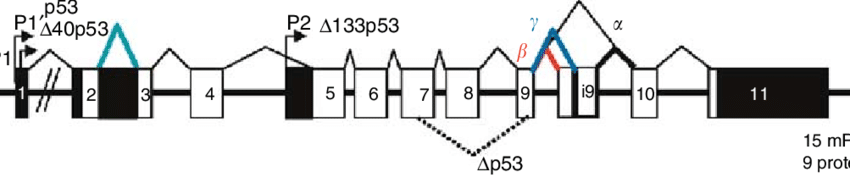

# Introduction to Bioinformatics

## Setting up our environment


Download VirtualBox:
https://www.virtualbox.org/wiki/Downloads

Download 64bit Ubuntu 18.04:
http://releases.ubuntu.com/18.04/ubuntu-18.04.3-desktop-amd64.iso

Install VirtualBox (we will install Ubuntu later)

## What is bioinformatics?

> Bioinformatics is the use of computer databases and computer algorithms to analyze proteins, genes, and the complete collection of DNA that comprises an organism (the genome).
>
> J. Pevsner

>Bioinformatics is the branch of biology that is concerned with the acquisition, storage, display, and analysis of the information found in nucleic acid and protein sequence data.
>
>National Human Genome Research Institute (NGHRI)

>Research, development, or application of computational tools and approaches for expanding the use of biological, medical, behavioral, or health data, including those to acquire, store, organize, analyze, or visualize such data.
>
> National Institutes of Health (NIH)

### The rise of Bioinformatics

Biology has traditionally been an observational rather than a deductive science.
The nature of the data has changed radically.
In the most recent generation, data have become more quantitative and precise.
It is possible to determine the genome sequence of an individual organism (experimental error, but high quality of sequencing methods)

### The different perspectives of Bioinformatics

TODO: image from Pevsner

## Why is bioinformatics so important?

### The explosion of sequence data

The famous Moore’s law in silicon chips was stated as “a halving of feature size every 18 months” .
Sequencing technology has evolved much faster.


@EMBL-EBI2018


@NationalHumanGenomeResearchInstitute2019

### Applications

Potential scientific solutions to serious problems that human
society faces:
Health benefits (humans, animals, plants). E.g.: analysis of genome sequence data can identify risks, aid diagnosis and prognosis of disease, and guide treatments tailored to the patient.
Guiding conservation efforts (preservation of endangered species).
Identifying the causes and effects of climate change and developing ways to slow it down.

Basically, the applications of biology and the biomedical sciences. 
Biology and medicine won’t be separable from bioinformatics

### Job opportunities

There is a huge demand for bioinformaticians.
Pretty much every biology lab has to do some bioinformatics today. Most biologists are not equipped to be able to handle the work.
Whether that translates into job opportunities is another matter


@Martti

## Molecular Biology refresher

### Biological Macromolecules

DNA: polymer of deoxyribonucleotides
RNA: polymer of ribonucleotides
Proteins: polymer of aminoacids

All of them are heteropolymers: they have a sequence which is critical to their function. And that sequence determines their function.

### The Central Dogma of Molecular Biology


@KhanAcademy


@CDKL5UK

In eukaryotes, not every nucleotide goes into the final mature mRNA. Some are eliminated by splicing.

### Structure of a gene

TODO: good image

A lot of what bioinformatics is about is having those letters and painting those colors from them
In reality, it is even more complex: see next slide

### Representation of a gene

  

@Bourdon 

### Transcriptional regulation

TODO: image and citation

Regulation of gene expression is exerted at every step in the process, but mainly at transcription.

### Transcription factors 

A transcription factor (TF) is a protein that binds DNA and affects the transcription of a nearby gene.
They can increase or decrease transcription. 
A single transcription factor is usually mostly repressive (inhibits transcription) or activating (increases transcription).
Transcription factors bind particular places in the genome. The binding sites for several transcription factors are often grouped in promoter and enhancers, collectively known as cis-regulatory elements.

### Cis regulatory elements

TODO: image and citation

Regions of non-coding DNA that bind transcription factors, and that regulate the expression of a nearby gene.

* Promoter: the region near the Transcription Start Site (TSS) of a gene that binds the core transcriptional machinery and related transcription factors.
* Enhancer: a region farther away from a TSS that binds TFs and affects the transcription of the gene in question.

Often, regulatory sequences are evolutionarily conserved. This means that they are more similar across related species than would be expected by chance.


### Evolutionary conservation of genomic sequence

The process of evolution is driven by mutation and natural selection.
At a genomic level, it results in differences in genetic sequence. These differences are greater the longer ago two species separated.
Not every part of the genome diverges at the same rate. If a part of the genome is critical to the survival of the individual, it will be highly evolutionarily conserved.

## Types of bioinformatics software

### GUI vs CLI

TODO: image from Pevsner

Graphical User Interface software is more intuitive and thus more accessible.
Command Line Interface software has stricter prerequisites, but is much more flexible.

#### GUI or web-based software

Need of the Internet to:
* Access sequence data
* Access software to analyze molecular data
* Integrate different kinds of resources and info relevant to biology

Tools and resources available on the Internet:
* Accessible (requiring no programming expertise)
* Easy to browse to explore their depth and breadth
* Very popular
* Familiar (available on any web browser on any platform)

Publicly accessible DBs, repositories for DNA and protein data:

* The National Center for Biotechnology Information (NCBI)
    http://ncbi.nlm.nih.gov
    
* The European Bioinformatics Institute (EBI)
    http://www.ebi.ac.uk/
    
* The University of California at Santa Cruz (UCSC) Genome Browser
    http://genome.ucsc.edu/

#### Command Line Interface software

Operating system:
* Linux

Programming languages: 
* Perl, Python, R

Application:
* Large datasets (e.g. high throughput technologies generate millions to billions or even trillions of data points) requiring command-line tools to manipulate the data.
* Reproducibility

### Bridging the 2 cultures

TODO: Galaxy screenshot

Galaxy presents a web-based GUI for many popular command line tools ties them together.


### In this course

OS: Linux, optionally MacOS X

If you have a Windows machine, we will install Virtualbox and a copy of Ubuntu inside the virtual machine in this class
The exercises will be sized for a VM with 4GB RAM and a 2-core processor.

https://www.virtualbox.org/wiki/Downloads
https://www.ubuntu.com/download/desktop

### Virtual Machines

VirtualBox and other VM software allow us to run an operating system inside another. 

The host is the regular OS
The guest is the OS running inside a virtual machine

TODO: VM screenshot

## VMs with VirtualBox

Install VirtualBox as appropriate for your operating system.
You might need to change options in the BIOS to enable the virtualization extensions of your processor.

1. Create a new VM
    1. Click “new”
    2. Name your VM and choose Ubuntu 64bit
    3. Select 4096MB RAM
    4. Create a new Virtual Disk Drive, of the default type, dynamically allocated, and give it at least 100GB of space.
    5. You are done!

2. Install Ubuntu
    1. Go to the settings for your VM
    2. Select the disk and click the little disk icon.
    3. Navigate to the .iso for Ubuntu that you downloaded earlier.
    4. Start the VM 
    5. Follow the installer instructions.

3. Install Conda
    Conda is usually used as a package manager for Python, but we are going to use it here to facilitate installing many bioinformatics programs.
    1. Download miniconda (Linux 64bit, Python 3.7)
        https://docs.conda.io/en/latest/miniconda.html
    2. Use bash to run the installer you just downloaded. Reply “yes” to both questions.
    3. Close the terminal and open a new one. Anaconda should be ready to use.

## Linux overview

Why use Linux?

* It’s fast
* It’s free
* Most research software is released for Linux, or not built at all
* You don’t need to install it to test it: just download Virtualbox and install Ubuntu on a Virtual Machine


### The shell

The shell is the program that reads and interprets what we write in a terminal, and returns the output to us
~ the “command line”

### The Unix philosophy:

> Write programs that do one thing and do it well. Write programs to work together. Write programs to handle text streams, because that is a universal interface.
>
> Doug McIlroy

* Modularity
* Flexibility

Choose the right tool for the job, freedom to swap components as needed.


### Piping and redirecting output

The pipe character (“|”) takes the standard output from a command and sends it to the standard input of another command
The greater than character (“>”) takes the standard output from a command and sends it to a file.

Navigating the file hierarchy: absolute paths in Linux start with “/”

Essential navigation commands:
* pwd
* cd
* cd ..
* ls

Examining file contents:
* cat
* less
* head
* tail

Manipulating files and folders
* cp
* mv
* rm
* mkdir
* rmdir

Getting help
* help
* man

## Git for scientists

### Version control software

* Maintain snapshots of projects in a space efficient and browsable manner.
* Track changes and easily find which change introduced a bug.
* Make it easier to collaborate.

Imagine erasing your lab notebook as new results come in. How would you know how you arrived to the results from last year’s paper?

### Git

Created by Linus Torvalds, it is the most commonly used version control software in the world.
Hosted git services: GitHub, Bitbucket, GitLab.
Works through subcommands:

* git init
* git add
* git commit
* git merge
* git pull
* git push

… and many others


#### Creating a repository

Go to a folder in your terminal and execute:
```bash
git init
```

This will start an empty repository.
If this is the first time you use this install of git, you will need to `git config` first.


#### The staging environment and commits

With git, you work normally on your project, which will result in adding, eliminating or changing files. Once you get to a point which represents a coherent change from the previous state, you create a commit. A commit represents this set of related changes.
You do this by adding files to the staging environment with git add. This is like rehearsing what you want to commit.
Once you are happy with the changes that you will commit, you create the commit with git commit. This will open the default text editor and allow you to write the commit message.

https://product.hubspot.com/blog/git-and-github-tutorial-for-beginners


#### Merges and branches

Git makes it easy to collaborate and to work on different aspects of your project through the concept of branches.
Branches can be created and switched to and from, and represent sets of independent commits.
At some points, branches will have to be merged. This can create merge conflicts which will have to be resolved by you.


#### Working with remote repos: pull and push

In git, there is no concept of a central repository. Every collaborator has a copy of the whole repository with the whole history of changes in their computer.
However, usually, we use a copy of the repo in a server like GitHub as the central repo. We then pull new changes to that repo and push changes to that repo.
The most important thing to remember: always pull immediately before pushing!

#### Pull Requests: a GitHub innovation

GitHub changed the way people collaborate in software by introducing the pull request.
When you have many collaborators in a project, instead of giving them all write access, the workflow goes like this:

1. They create personal copies of the repository (“forks”).
2. They make the desired changes to their fork.
3. They request you to pull from their fork.
4. You review the changes, accept (or decline them) and merge into your code.


#### How to git pretty

http://justinhileman.info/article/changing-history/
