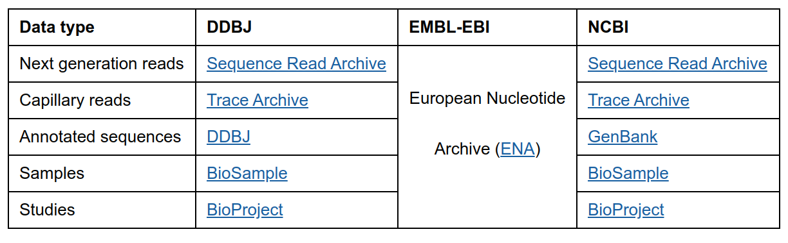
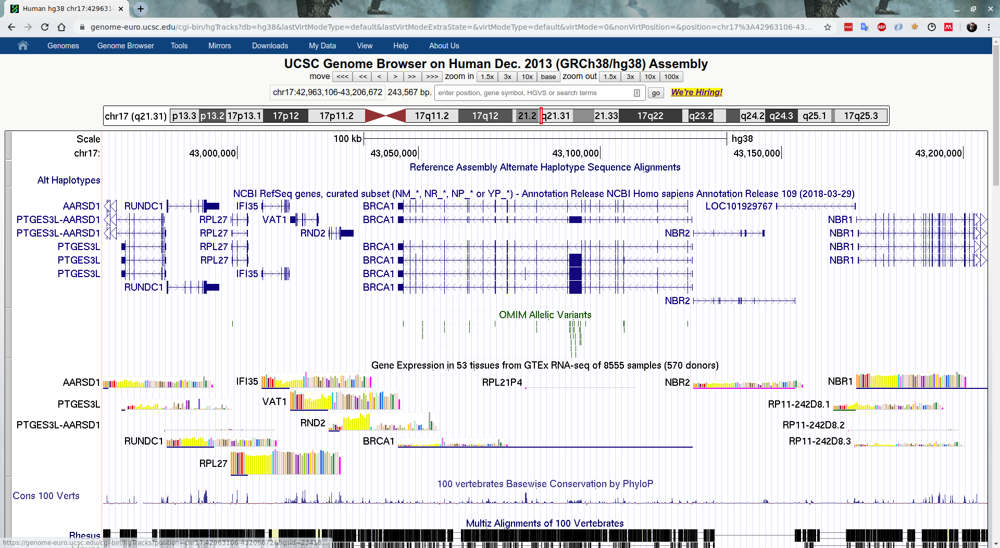
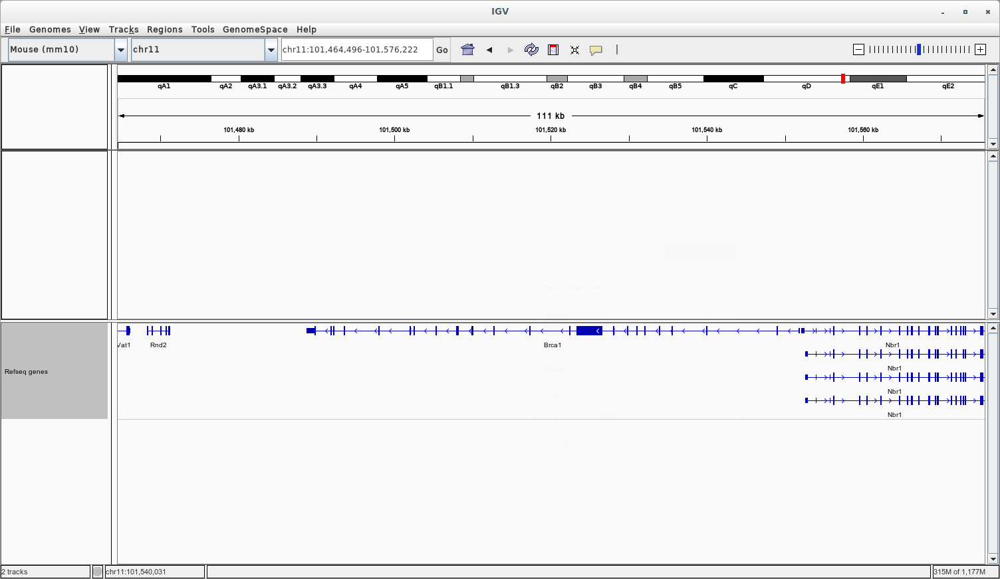
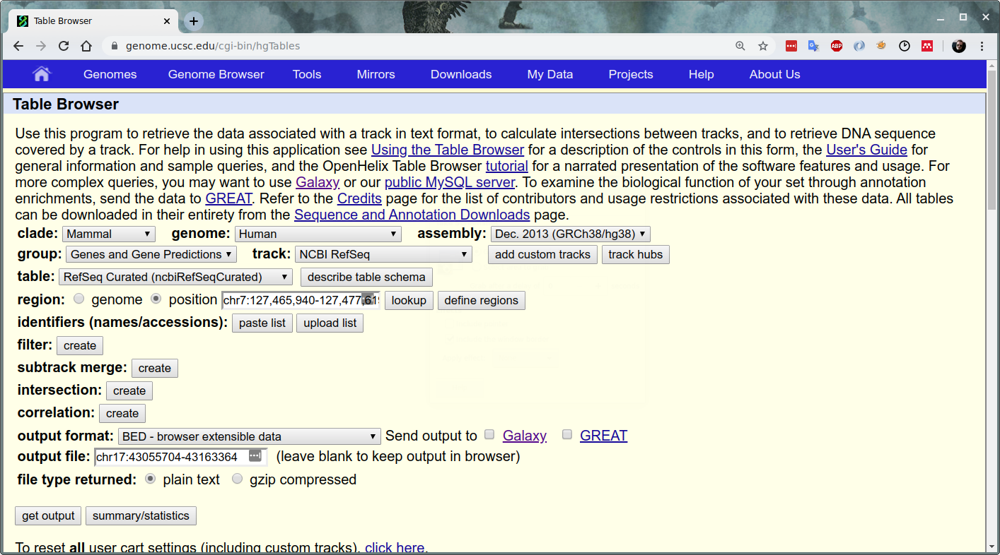
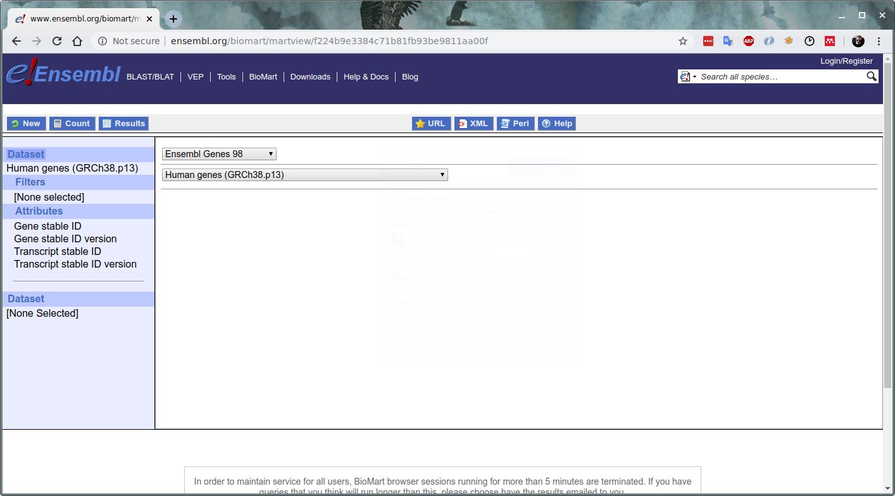

# Databases and the scientific literature

## Scientific literature

History of scientific literature

Conventional scientific literature:

Formal written articles or books

Euclid, Newton, Copernicus…

Currently, most scientific literature is published as peer-reviewed journals 

### Why is communication important in science?

### Peer-reviewed journals

First journal: Philosophical Transactions of the Royal Society

Functions:

* Dissemination of knowledge

* Registration of credit

Use of external reviewers only became common in the second half of the XXth century.

@Spier2002

### Peer review

The peer review system exists to validate academic work and helps to improve the quality of published research.

It takes the form of anonymous reviews requested by the editor when deciding whether to publish a manuscript.

@Elsevier


### Physical libraries

Until relatively recently, a scientific organization produced and distributed at regular intervals, a paperbound “issue” containing one or more articles:

* High costs of production

* Sources of support: sales, page charges to authors...

* Several trends have buffeted the system:

* More papers are being published

Problem of space in libraries

Electronic facilities


### Grant evaluation and the importance of publishing

Most funding agencies give grants taking into account impact factor (IF).

IF is a journal-level metric. It measures the average number of citations in a year, per article published  in the previous two years.

Example: 2017 impact factor

A = the number of times articles published in 2015 and 2016 were cited by indexed journals during 2017.

B = the total number of "citable items" published in 2015 and 2016.

2017 impact factor  =  A/B
 
@DeGroote2016


### The effect of Impact Factor on evaluation

Since it is a journal level metric, strong incentive to publish on top journals.

No effect of quality of the paper itself, within the same journal.

Editorials have a very strong position.

### Open Access

In the last years there’s been a strong push from scientists and funding agencies to move to an open access model.

Retains the “peer-review” as the criterion for publication.

Accepted articles are placed on the web.

Free access.

Freely usable by readers.

Authors retain copyright, rather than assign it to the publisher.

### Open Access mandates

NIH Public Access Policy: 2008

Fair Access to Science and Technology Research (FASTR) Act: proposed (USA)

Plan S: 2020


https://en.wikipedia.org/wiki/NIH_Public_Access_Policy

https://www.nature.com/articles/d41586-018-06178-7

https://en.wikipedia.org/wiki/Fair_Access_to_Science_and_Technology_Research_Act


### sci-hub


Founded by Alexandra Elbakyan in 2011.

Based on sharing of credentials and storage of the downloaded papers.

https://en.wikipedia.org/wiki/Sci-Hub


### The preprint push

Preprints: papers published before peer-review.

arXiv: preprint server for physics and math, mostly. Since 1991.

bioRxiv: preprint server for biology 2013.

Effects:

* Speed up sharing of research results, more transparency

* Priority Claims

* Undermine journals’ business case.

Prelights: an initiative to select and criticize choice preprints in biology.

https://arxiv.org/

https://www.biorxiv.org/

https://prelights.biologists.com/

### Post-publication peer review

Pubpeer: Website for post-publication peer review

https://pubpeer.com/ 

#### Exercise: 

search for articles by Susana González. Read a few of the reviews. Do you find anything amiss?

https://pubpeer.com/publications/CD3325D6086BF005D1C72E75ED722D#17


## Searching the literature

### PubMed

For biomedical literature:

National Library of Medicine (NML)

World’s largest medical library

Created in 1971

MEDLINE (Medical Literature, Analysis and Retrieval System Online): bibliographic DB

Free access is provided by
https://www.ncbi.nlm.nih.gov/pubmed/

PubMed: DB from NLM

* Bibliographic component of the DB ENTREZ (NCBI)

How does it work?

https://www.ncbi.nlm.nih.gov/pubmed/


#### How to search PubMed

Boolean operators

Wildcard: *

Helpful tags:

[au]: author

[ti]: title

[tiab]: title/abstract

[tw]: text words


#### PubMed search exercises

* Find all papers that I (Daniel Mateos San Martín) have published.

* Find all papers that my PhD advisor (Miguel Torres) has ever published in Nature, Cell, or Science.

* Find all those that he published in any journal in 2013, that did not include me as one of the authors. 


### Other Literature DBs

Google Scholar: open

https://scholar.google.com/

ScienceDirect: by subscription

http://www.sciencedirect.com/

Scopus: by subscription

https://www.scopus.com


### Google Scholar

Convenient and fast. Covers also books and other pieces of literature.

https://scholar.google.com/

Easy to filter and build more complex queries, and to see how many other papers have cited a piece of research.

Easy to export citations as well.

#### Exercise

Perform the same search (papers by Daniel Mateos San Martín) in the previous databases. Compare the results.
How many citations has each of the papers received?

## How to read a scientific paper

What is a scientific paper?

* Peer reviewed.

* Presents novel findings (results).

* Reproducible

@Savage

https://imgur.com/1h3K2TT/ 


### Structure of a paper

* Title: concise and expressive

* Abstract: a short summary of the whole paper.

* Introduction: relevant background, starting hypothesis.

* Methods: should be enough to replicate the paper.

* Results: explanation of the results, with a logical progression but without much interpretation. The core of the paper are the data, which are communicated through figures and tables. All the rest is there to support the data.

* Discussion: interpretation of the results.

* Acknowledgments: apart from personal acknowledgements, this section includes the sources of funding.
Literature cited: it should be an appropriate and comprehensive list of the sources used.

@KenyonCollege

### How to read a paper

There are many ways to read a paper.

One option is the “three pass method”:

1. Do a quick overview, reading the title, abstract, introduction and conclusions.

2. Read carefully the whole text, studying the figures in detail.

3. Re-create mentally the paper.

@Keshav

https://web.stanford.edu/class/ee384m/Handouts/HowtoReadPaper.pdf.

### The Feynman technique

Choose a subject

Write an explanation of what you understand about it.

Identify gaps in your knowledge, and go to the sources to fill them.

Repeat steps 2 and 3 until satisfied.

@Fe

https://fs.blog/2012/04/feynman-technique/.

### Bibliography management

Staying on top of a subject:

* Alerts

* RSS

* Blogs

Organizing and sharing the harvest:

* Bookmarks or favorites: not so useful

Programs to collect literature references online:

* Papers

* Mendeley

* Refworks

* EndNote

### Mendeley 

Mendeley is a free and multi-platform bibliography management tool.

You collect references in it, which can then be exported or used to format a document inside Word or LibreOffice.

#### Adding references to Mendeley

* Manually

* Web Importer plugin

* The Mendeley Research Catalog

* From a BibTeX file

@Mendeley

https://blog.mendeley.com/2011/03/21/7-ways-to-add-documents-to-mendeley/

#### Inserting citations into a document

Drag-and-drop: quick and convenient for immediate use.

LibreOffice or Word Mendeley plugin: much more appropriate for writing a report, since it will generate the bibliography for you.

LaTeX + BibTeX: a whole other level. Highly recommended for writing longer documents such as a thesis.

### Bibtex

Bibliography management format to be used with LaTeX. 

```latex
@article{mrx05, 
  auTHor = "Mr. X", 
  Title = {Something Great}, 
  publisher = "nob" # "ody", 
  YEAR = 2005, 
} 
```


http://www.bibtex.org/Using/


### Citation styles

Chicago:

Li, Yifeng, Wenqiang Shi, and Wyeth W. Wasserman. 2016. “Genome-Wide Prediction of Cis-Regulatory Regions Using Supervised Deep Learning Methods.” BioRxiv, February, 041616. https://doi.org/10.1101/041616.

APA
Li, Y., Shi, W., & Wasserman, W. W. (2016). Genome-Wide Prediction of cis-Regulatory Regions Using Supervised Deep Learning Methods. BioRxiv, 041616. https://doi.org/10.1101/041616

Nature
1. Li, Y., Shi, W. & Wasserman, W. W. Genome-Wide Prediction of cis-Regulatory Regions Using Supervised Deep Learning Methods. bioRxiv 041616 (2016). doi:10.1101/041616

### Which citation style should I use?

If you are submitting a paper to a journal, use the one required by the journal. 

Else, use the Chicago style (author-date).

@CitationToolsSupportTeam

## Biomedical databases

Stores data in a structured manner.

Complex model of tables and accompanying connections.

Specific structure: enables the entering & extraction of data.

Files or tables containing records and fields.

### Flat-file

Stores data as text files.

The file contains one record per line.

It has to be updated.


### The FASTA format

```
>NP_000552.2 glutathione S-transferase Mu 1 isoform 1 [Homo sapiens]
MPMILGYWDIRGLAHAIRLLLEYTDSSYEEKKYTMGDAPDYDRSQWLNEKFKLGLDFPNLPYLIDGAHKI
TQSNAILCYIARKHNLCGETEEEKIRVDILENQTMDNHMQLGMICYNPEFEKLKPKYLEELPEKLKLYSE
FLGKRPWFAGNKITFVDFLVYDVLDLHRIFEPKCLDAFPNLKDFISRFEGLEKISAYMKSSRFLPRPVFS
KMAVWGNK

>NP_666533.1 glutathione S-transferase Mu 1 isoform 2 [Homo sapiens]
MPMILGYWDIRGLAHAIRLLLEYTDSSYEEKKYTMGDAPDYDRSQWLNEKFKLGLDFPNLPYLIDGAHKI
TQSNAILCYIARKHNLCGETEEEKIRVDILENQTMDNHMQLGMICYNPEFEKLKPKYLEELPEKLKLYSE
FLGKRPWFAGNKGLEKISAYMKSSRFLPRPVFSKMAVWGNK

>XP_005270839.1 glutathione S-transferase Mu 1 isoform X1 [Homo sapiens]
MGDAPDYDRSQWLNEKFKLGLDFPNLPYLIDGAHKITQSNAILCYIARKHNLCGETEEEKIRVDILENQT
MDNHMQLGMICYNPEFEKLKPKYLEELPEKLKLYSEFLGKRPWFAGNKITFVDFLVYDVLDLHRIFEPKC
LDAFPNLKDFISRFEGLEKISAYMKSSRFLPRPVFSKMAVWGNK
```

https://www.ncbi.nlm.nih.gov/protein/NP_000552.2,NP_666533.1,XP_005270839.1


### EMBL / Swissprot flatfiles

```
ID   GSTM1_HUMAN             Reviewed;         218 AA.
AC   P09488; Q5GHG0; Q6FH88; Q8TC98; Q9UC96;
DT   01-JUL-1989, integrated into UniProtKB/Swiss-Prot.
DT   23-JAN-2007, sequence version 3.
DT   13-NOV-2019, entry version 204.
DE   RecName: Full=Glutathione S-transferase Mu 1;
DE            EC=2.5.1.18;
DE   AltName: Full=GST HB subunit 4;
DE   AltName: Full=GST class-mu 1;
DE   AltName: Full=GSTM1-1;
DE   AltName: Full=GSTM1a-1a;
DE   AltName: Full=GSTM1b-1b;
DE   AltName: Full=GTH4;
GN   Name=GSTM1; Synonyms=GST1;
OS   Homo sapiens (Human).
OC   Eukaryota; Metazoa; Chordata; Craniata; Vertebrata; Euteleostomi;
OC   Mammalia; Eutheria; Euarchontoglires; Primates; Haplorrhini;
OC   Catarrhini; Hominidae; Homo.
OX   NCBI_TaxID=9606;
RN   [1]
RP   NUCLEOTIDE SEQUENCE [MRNA] (ISOFORM 1), AND VARIANT ASN-173 (ALLELE
RP   GSTM1B).
RX   PubMed=3419925; DOI=10.1093/nar/16.17.8541;
RA   Dejong J.L., Chang C.M., Whang Peng J., Knutsen T., Tu C.-P.D.;
RT   "The human liver glutathione S-transferase gene superfamily:
RT   expression and chromosome mapping of an Hb subunit cDNA.";
RL   Nucleic Acids Res. 16:8541-8554(1988).
RN   [2]
RP   NUCLEOTIDE SEQUENCE [MRNA] (ISOFORM 1).
RX   PubMed=3174634; DOI=10.1073/pnas.85.19.7293;
RA   Seidegaard J., Vorachek W.R., Pero R.W., Pearson W.R.;
RT   "Hereditary differences in the expression of the human glutathione
RT   transferase active on trans-stilbene oxide are due to a gene
RT   deletion.";
RL   Proc. Natl. Acad. Sci. U.S.A. 85:7293-7297(1988).
RN   [3]
RP   NUCLEOTIDE SEQUENCE [MRNA] (ISOFORM 1), AND VARIANT ASN-173 (ALLELE
RP   GSTM1B).
RC   TISSUE=Liver;
RA   Chen P., Wu Y., Zhang C., Han L., Wu Y., Xie D., Chen L.;
RL   Submitted (DEC-2003) to the EMBL/GenBank/DDBJ databases.
RN   [4]
RP   NUCLEOTIDE SEQUENCE [MRNA] (ISOFORMS 1 AND 2).
RC   TISSUE=Liver;
RA   Chen P., Zhang C., Xie D., Wu Y., Han L., Chen L.;
RL   Submitted (JAN-2004) to the EMBL/GenBank/DDBJ databases.
RN   [5]
RP   NUCLEOTIDE SEQUENCE [LARGE SCALE MRNA] (ISOFORM 1), AND VARIANT
RP   ASN-173 (ALLELE GSTM1B).
RA   Halleck A., Ebert L., Mkoundinya M., Schick M., Eisenstein S.,
RA   Neubert P., Kstrang K., Schatten R., Shen B., Henze S., Mar W.,
RA   Korn B., Zuo D., Hu Y., LaBaer J.;
RT   "Cloning of human full open reading frames in Gateway(TM) system entry
RT   vector (pDONR201).";
RL   Submitted (JUN-2004) to the EMBL/GenBank/DDBJ databases.
RN   [6]
RP   NUCLEOTIDE SEQUENCE [LARGE SCALE MRNA] (ISOFORM 2).
RC   TISSUE=Testis;
RX   PubMed=15489334; DOI=10.1101/gr.2596504;
RG   The MGC Project Team;
RT   "The status, quality, and expansion of the NIH full-length cDNA
RT   project: the Mammalian Gene Collection (MGC).";
RL   Genome Res. 14:2121-2127(2004).
RN   [7]
RP   NUCLEOTIDE SEQUENCE [GENOMIC DNA] OF 1-189 (ISOFORM 1), AND VARIANT
RP   ASN-173 (ALLELE GSTM1B).
RX   PubMed=8471052; DOI=10.1042/bj2910041;
RA   Zhong S., Spurr N.K., Hayes J.D., Wolf C.R.;
RT   "Deduced amino acid sequence, gene structure and chromosomal location
RT   of a novel human class Mu glutathione S-transferase, GSTM4.";
RL   Biochem. J. 291:41-50(1993).
RN   [8]
RP   PROTEIN SEQUENCE OF 2-31, AND TISSUE SPECIFICITY.
RC   TISSUE=Fetal liver;
RX   PubMed=7822249; DOI=10.1093/oxfordjournals.jbchem.a124525;
RA   Mera N., Ohmori S., Itahashi K., Kiuchi M., Igarashi T., Rikihisa T.,
RA   Kitada M.;
RT   "Immunochemical evidence for the occurrence of Mu class glutathione S-
RT   transferase in human fetal livers.";
RL   J. Biochem. 116:315-320(1994).
RN   [9]
RP   PROTEIN SEQUENCE OF 2-25.
RC   TISSUE=Aorta, and Heart;
RX   PubMed=2110160;
RA   Tsuchida S., Maki T., Sato K.;
RT   "Purification and characterization of glutathione transferases with an
RT   activity toward nitroglycerin from human aorta and heart. Multiplicity
RT   of the human class Mu forms.";
RL   J. Biol. Chem. 265:7150-7157(1990).
RN   [10]
RP   PROTEIN SEQUENCE OF 2-24.
RX   PubMed=3979555; DOI=10.1016/0014-5793(85)80324-0;
RA   Alin P., Mannervik B., Joernvall H.;
RT   "Structural evidence for three different types of glutathione
RT   transferase in human tissues.";
RL   FEBS Lett. 182:319-322(1985).
RN   [11]
RP   PROTEIN SEQUENCE OF 2-24.
RX   PubMed=3864155; DOI=10.1073/pnas.82.21.7202;
RA   Mannervik B., Alin P., Guthenberg C., Jensson H., Tahir M.K.,
RA   Warholm M., Joernvall H.;
RT   "Identification of three classes of cytosolic glutathione transferase
RT   common to several mammalian species: correlation between structural
RT   data and enzymatic properties.";
RL   Proc. Natl. Acad. Sci. U.S.A. 82:7202-7206(1985).
RN   [12]
RP   PROTEIN SEQUENCE OF 2-15.
RX   PubMed=1846734; DOI=10.1016/0003-9861(91)90329-h;
RA   Singhal S.S., Ahmad H., Sharma R., Gupta S., Haque A.K., Awasthi Y.C.;
RT   "Purification and characterization of human muscle glutathione S-
RT   transferases: evidence that glutathione S-transferase zeta corresponds
RT   to a locus distinct from GST1, GST2, and GST3.";
RL   Arch. Biochem. Biophys. 285:64-73(1991).
RN   [13]
RP   PROTEIN SEQUENCE OF 2-13.
RC   TISSUE=Colon;
RX   PubMed=1420361; DOI=10.1016/0167-4781(92)90135-m;
RA   Singhal S.S., Saxena M., Awasthi S., Ahmad H., Sharma R.,
RA   Awasthi Y.C.;
RT   "Gender related differences in the expression and characteristics of
RT   glutathione S-transferases of human colon.";
RL   Biochim. Biophys. Acta 1171:19-26(1992).
RN   [14]
RP   PROTEIN SEQUENCE OF 53-60, AND IDENTIFICATION BY MASS SPECTROMETRY.
RC   TISSUE=Liver;
RX   PubMed=11271497;
RX   DOI=10.1002/1522-2683(200011)21:17<3785::aid-elps3785>3.0.co;2-2;
RA   Hubbard M.J., McHugh N.J.;
RT   "Human ERp29: isolation, primary structural characterisation and two-
RT   dimensional gel mapping.";
RL   Electrophoresis 21:3785-3796(2000).
RN   [15]
RP   NUCLEOTIDE SEQUENCE [GENOMIC DNA] OF 60-118.
RX   PubMed=2362832; DOI=10.1093/nar/18.12.3670;
RA   Comstock K.E., Sanderson B.J.S., Claflin G., Henner W.D.;
RT   "GST1 gene deletion determined by polymerase chain reaction.";
RL   Nucleic Acids Res. 18:3670-3670(1990).
RN   [16]
RP   NUCLEOTIDE SEQUENCE [MRNA] OF 125-186.
RX   PubMed=8317488;
RA   Pearson W.R., Vorachek W.R., Xu S.J., Berger R., Hart I., Vannais D.,
RA   Patterson D.;
RT   "Identification of class-mu glutathione transferase genes GSTM1-GSTM5
RT   on human chromosome 1p13.";
RL   Am. J. Hum. Genet. 53:220-233(1993).
RN   [17]
RP   X-RAY CRYSTALLOGRAPHY (2.68 ANGSTROMS), AND MUTAGENESIS OF HIS-108.
RX   PubMed=9930979; DOI=10.1021/bi982164m;
RA   Patskovsky Y.V., Patskovska L.N., Listowsky I.;
RT   "Functions of His107 in the catalytic mechanism of human glutathione
RT   S-transferase hGSTM1a-1a.";
RL   Biochemistry 38:1193-1202(1999).
RN   [18] {ECO:0000244|PDB:1YJ6}
RP   X-RAY CRYSTALLOGRAPHY (2.50 ANGSTROMS) IN COMPLEX WITH GLUTATHIONE.
RA   Patskovsky Y.V., Patskovska L.N., Listowsky I., Almo S.C.;
RT   "Human glutathione S-transferase M1A-1A catalyzes formation of Gsh-
RT   metal complexes.";
RL   Submitted (JAN-2005) to the PDB data bank.
RN   [19]
RP   X-RAY CRYSTALLOGRAPHY (1.9 ANGSTROMS) IN COMPLEXES WITH GLUTAHIONE
RP   ANALOGS, CATALYTIC ACTIVITY, FUNCTION, AND MUTAGENESIS OF TYR-7;
RP   HIS-108; MET-109 AND TYR-116.
RX   PubMed=16548513; DOI=10.1021/bi051823+;
RA   Patskovsky Y., Patskovska L., Almo S.C., Listowsky I.;
RT   "Transition state model and mechanism of nucleophilic aromatic
RT   substitution reactions catalyzed by human glutathione S-transferase
RT   M1a-1a.";
RL   Biochemistry 45:3852-3862(2006).
CC   -!- FUNCTION: Conjugation of reduced glutathione to a wide number of
CC       exogenous and endogenous hydrophobic electrophiles.
CC       {ECO:0000269|PubMed:16548513}.
CC   -!- CATALYTIC ACTIVITY:
CC       Reaction=glutathione + RX = a halide anion + an S-substituted
CC         glutathione + H(+); Xref=Rhea:RHEA:16437, ChEBI:CHEBI:15378,
CC         ChEBI:CHEBI:16042, ChEBI:CHEBI:17792, ChEBI:CHEBI:57925,
CC         ChEBI:CHEBI:90779; EC=2.5.1.18;
CC         Evidence={ECO:0000269|PubMed:16548513};
CC   -!- SUBUNIT: Homodimer.
CC   -!- SUBCELLULAR LOCATION: Cytoplasm.
CC   -!- ALTERNATIVE PRODUCTS:
CC       Event=Alternative splicing; Named isoforms=2;
CC       Name=1;
CC         IsoId=P09488-1; Sequence=Displayed;
CC       Name=2;
CC         IsoId=P09488-2; Sequence=VSP_036618;
CC   -!- TISSUE SPECIFICITY: Liver (at protein level).
CC       {ECO:0000269|PubMed:7822249}.
CC   -!- POLYMORPHISM: There are two alleles; GSTM1A and GSTM1B which
CC       differ in position 173. The sequence shown is that of allele
CC       GSTM1A. {ECO:0000269|PubMed:3174634, ECO:0000269|PubMed:8471052,
CC       ECO:0000269|Ref.3, ECO:0000269|Ref.5}.
CC   -!- SIMILARITY: Belongs to the GST superfamily. Mu family.
CC       {ECO:0000305}.
CC   -!- WEB RESOURCE: Name=SHMPD; Note=The Singapore human mutation and
CC       polymorphism database;
CC       URL="http://shmpd.bii.a-star.edu.sg/gene.php?genestart=A&genename=GSTM1";
CC   -----------------------------------------------------------------------
CC   Copyrighted by the UniProt Consortium, see https://www.uniprot.org/terms
CC   Distributed under the Creative Commons Attribution (CC BY 4.0) License
CC   -----------------------------------------------------------------------
DR   EMBL; X08020; CAA30821.1; -; mRNA.
DR   EMBL; J03817; AAA59203.1; -; mRNA.
DR   EMBL; AY510272; AAR85979.1; -; mRNA.
DR   EMBL; AY532926; AAT06767.1; -; mRNA.
DR   EMBL; AY532927; AAT06768.1; -; mRNA.
DR   EMBL; CR541868; CAG46666.1; -; mRNA.
DR   EMBL; BC024005; AAH24005.1; -; mRNA.
DR   EMBL; X68676; CAA48636.1; -; Genomic_DNA.
DR   EMBL; X51451; CAA35817.1; -; Genomic_DNA.
DR   CCDS; CCDS809.1; -. [P09488-1]
DR   CCDS; CCDS810.1; -. [P09488-2]
DR   PIR; S01719; S01719.
DR   RefSeq; NP_000552.2; NM_000561.3. [P09488-1]
DR   RefSeq; NP_666533.1; NM_146421.2. [P09488-2]
DR   PDB; 1GTU; X-ray; 2.68 A; A/B/C/D=2-218.
DR   PDB; 1XW6; X-ray; 1.90 A; A/B/C/D=1-218.
DR   PDB; 1XWK; X-ray; 2.30 A; A/B/C=1-218.
DR   PDB; 1YJ6; X-ray; 2.50 A; A/B/C=1-218.
DR   PDB; 2F3M; X-ray; 2.70 A; A/B/C/D/E/F=1-218.
DR   PDBsum; 1GTU; -.
DR   PDBsum; 1XW6; -.
DR   PDBsum; 1XWK; -.
DR   PDBsum; 1YJ6; -.
DR   PDBsum; 2F3M; -.
DR   SMR; P09488; -.
DR   BioGrid; 109199; 9.
DR   IntAct; P09488; 11.
DR   STRING; 9606.ENSP00000311469; -.
DR   BindingDB; P09488; -.
DR   ChEMBL; CHEMBL2081; -.
DR   DrugBank; DB01834; (9R,10R)-9-(S-glutathionyl)-10-hydroxy-9,10-dihydrophenanthrene.
DR   DrugBank; DB04187; (9S,10S)-9-(S-glutathionyl)-10-hydroxy-9,10-dihydrophenanthrene.
DR   DrugBank; DB03314; 5-fluorotryptophan.
DR   DrugBank; DB00993; Azathioprine.
DR   DrugBank; DB01008; Busulfan.
DR   DrugBank; DB00958; Carboplatin.
DR   DrugBank; DB00515; Cisplatin.
DR   DrugBank; DB11672; Curcumin.
DR   DrugBank; DB14635; Curcumin sulfate.
DR   DrugBank; DB00143; Glutathione.
DR   DrugBank; DB00526; Oxaliplatin.
DR   DrugBank; DB02458; S-(2,4-dinitrophenyl)glutathione.
DR   DrugBank; DB02165; Zinc Trihydroxide.
DR   SwissLipids; SLP:000001613; -.
DR   iPTMnet; P09488; -.
DR   PhosphoSitePlus; P09488; -.
DR   BioMuta; GSTM1; -.
DR   DMDM; 121735; -.
DR   EPD; P09488; -.
DR   jPOST; P09488; -.
DR   MassIVE; P09488; -.
DR   PaxDb; P09488; -.
DR   PeptideAtlas; P09488; -.
DR   PRIDE; P09488; -.
DR   ProteomicsDB; 52227; -. [P09488-1]
DR   ProteomicsDB; 52228; -. [P09488-2]
DR   DNASU; 2944; -.
DR   Ensembl; ENST00000309851; ENSP00000311469; ENSG00000134184. [P09488-1]
DR   Ensembl; ENST00000349334; ENSP00000234981; ENSG00000134184. [P09488-2]
DR   GeneID; 2944; -.
DR   KEGG; hsa:2944; -.
DR   CTD; 2944; -.
DR   DisGeNET; 2944; -.
DR   GeneCards; GSTM1; -.
DR   HGNC; HGNC:4632; GSTM1.
DR   HPA; CAB022669; -.
DR   HPA; CAB047357; -.
DR   HPA; HPA055972; -.
DR   HPA; HPA055973; -.
DR   MIM; 138350; gene.
DR   neXtProt; NX_P09488; -.
DR   OpenTargets; ENSG00000134184; -.
DR   PharmGKB; PA182; -.
DR   eggNOG; ENOG410IN5J; Eukaryota.
DR   eggNOG; ENOG4110YU0; LUCA.
DR   GeneTree; ENSGT00940000160258; -.
DR   HOGENOM; HOG000115735; -.
DR   InParanoid; P09488; -.
DR   KO; K00799; -.
DR   OrthoDB; 1162336at2759; -.
DR   PhylomeDB; P09488; -.
DR   TreeFam; TF353040; -.
DR   BRENDA; 2.5.1.18; 2681.
DR   Reactome; R-HSA-156590; Glutathione conjugation.
DR   SABIO-RK; P09488; -.
DR   SIGNOR; P09488; -.
DR   ChiTaRS; GSTM1; human.
DR   EvolutionaryTrace; P09488; -.
DR   GeneWiki; Glutathione_S-transferase_Mu_1; -.
DR   GenomeRNAi; 2944; -.
DR   Pharos; P09488; -.
DR   PRO; PR:P09488; -.
DR   Proteomes; UP000005640; Chromosome 1.
DR   Bgee; ENSG00000134184; Expressed in 92 organ(s), highest expression level in liver.
DR   ExpressionAtlas; P09488; baseline and differential.
DR   Genevisible; P09488; HS.
DR   GO; GO:0005737; C:cytoplasm; IDA:BHF-UCL.
DR   GO; GO:0005829; C:cytosol; IDA:HPA.
DR   GO; GO:0045171; C:intercellular bridge; IDA:HPA.
DR   GO; GO:0019899; F:enzyme binding; IPI:BHF-UCL.
DR   GO; GO:0043295; F:glutathione binding; IDA:BHF-UCL.
DR   GO; GO:0004364; F:glutathione transferase activity; IDA:BHF-UCL.
DR   GO; GO:0042803; F:protein homodimerization activity; IPI:BHF-UCL.
DR   GO; GO:0070458; P:cellular detoxification of nitrogen compound; IDA:BHF-UCL.
DR   GO; GO:1901687; P:glutathione derivative biosynthetic process; TAS:Reactome.
DR   GO; GO:0006749; P:glutathione metabolic process; IDA:BHF-UCL.
DR   GO; GO:0018916; P:nitrobenzene metabolic process; IDA:BHF-UCL.
DR   GO; GO:0042178; P:xenobiotic catabolic process; IDA:BHF-UCL.
DR   Gene3D; 3.40.30.10; -; 1.
DR   InterPro; IPR010987; Glutathione-S-Trfase_C-like.
DR   InterPro; IPR036282; Glutathione-S-Trfase_C_sf.
DR   InterPro; IPR040079; Glutathione_S-Trfase.
DR   InterPro; IPR004045; Glutathione_S-Trfase_N.
DR   InterPro; IPR004046; GST_C.
DR   InterPro; IPR003081; GST_mu.
DR   InterPro; IPR036249; Thioredoxin-like_sf.
DR   Pfam; PF14497; GST_C_3; 1.
DR   Pfam; PF02798; GST_N; 1.
DR   PRINTS; PR01267; GSTRNSFRASEM.
DR   SFLD; SFLDS00019; Glutathione_Transferase_(cytos; 1.
DR   SUPFAM; SSF47616; SSF47616; 1.
DR   SUPFAM; SSF52833; SSF52833; 1.
DR   PROSITE; PS50405; GST_CTER; 1.
DR   PROSITE; PS50404; GST_NTER; 1.
PE   1: Evidence at protein level;
KW   3D-structure; Alternative splicing; Complete proteome; Cytoplasm;
KW   Direct protein sequencing; Phosphoprotein; Polymorphism;
KW   Reference proteome; Transferase.
FT   INIT_MET      1      1       Removed. {ECO:0000269|PubMed:1420361,
FT                                ECO:0000269|PubMed:1846734,
FT                                ECO:0000269|PubMed:2110160,
FT                                ECO:0000269|PubMed:3864155,
FT                                ECO:0000269|PubMed:3979555,
FT                                ECO:0000269|PubMed:7822249}.
FT   CHAIN         2    218       Glutathione S-transferase Mu 1.
FT                                /FTId=PRO_0000185816.
FT   DOMAIN        2     88       GST N-terminal.
FT   DOMAIN       90    208       GST C-terminal.
FT   REGION        7      8       Glutathione binding. {ECO:0000269|Ref.18,
FT                                ECO:0000305|PubMed:16548513}.
FT   REGION       43     46       Glutathione binding. {ECO:0000269|Ref.18,
FT                                ECO:0000305|PubMed:16548513}.
FT   REGION       59     60       Glutathione binding. {ECO:0000269|Ref.18,
FT                                ECO:0000305|PubMed:16548513}.
FT   REGION       72     73       Glutathione binding. {ECO:0000269|Ref.18,
FT                                ECO:0000305|PubMed:16548513}.
FT   BINDING      50     50       Glutathione. {ECO:0000269|Ref.18,
FT                                ECO:0000305|PubMed:16548513}.
FT   BINDING     116    116       Substrate.
FT   MOD_RES      34     34       Phosphothreonine.
FT                                {ECO:0000250|UniProtKB:P10649}.
FT   MOD_RES     210    210       Phosphoserine.
FT                                {ECO:0000250|UniProtKB:P04905}.
FT   VAR_SEQ     153    189       Missing (in isoform 2).
FT                                {ECO:0000303|PubMed:15489334,
FT                                ECO:0000303|Ref.4}.
FT                                /FTId=VSP_036618.
FT   VARIANT     173    173       K -> N (in allele GSTM1B;
FT                                dbSNP:rs1065411).
FT                                {ECO:0000269|PubMed:3174634,
FT                                ECO:0000269|PubMed:8471052,
FT                                ECO:0000269|Ref.3, ECO:0000269|Ref.5}.
FT                                /FTId=VAR_003617.
FT   VARIANT     210    210       S -> T (in dbSNP:rs449856).
FT                                /FTId=VAR_014497.
FT   MUTAGEN       7      7       Y->F: Reduces catalytic activity 100-
FT                                fold. {ECO:0000269|PubMed:16548513}.
FT   MUTAGEN     108    108       H->Q: Reduces catalytic activity by half.
FT                                {ECO:0000269|PubMed:16548513,
FT                                ECO:0000269|PubMed:9930979}.
FT   MUTAGEN     108    108       H->S: Changes the properties of the
FT                                enzyme toward some substrates.
FT                                {ECO:0000269|PubMed:16548513,
FT                                ECO:0000269|PubMed:9930979}.
FT   MUTAGEN     109    109       M->I: Reduces catalytic activity by half.
FT                                {ECO:0000269|PubMed:16548513}.
FT   MUTAGEN     116    116       Y->A: Reduces catalytic activity 10-fold.
FT                                {ECO:0000269|PubMed:16548513}.
FT   MUTAGEN     116    116       Y->F: Slight increase of catalytic
FT                                activity. {ECO:0000269|PubMed:16548513}.
FT   CONFLICT     44     44       S -> T (in Ref. 7; CAA48636).
FT                                {ECO:0000305}.
FT   CONFLICT    207    207       P -> T (in Ref. 4; AAT06767).
FT                                {ECO:0000305}.
FT   STRAND        3     11       {ECO:0000244|PDB:1XW6}.
FT   HELIX        12     14       {ECO:0000244|PDB:1XW6}.
FT   HELIX        15     23       {ECO:0000244|PDB:1XW6}.
FT   STRAND       28     33       {ECO:0000244|PDB:1XW6}.
FT   TURN         38     41       {ECO:0000244|PDB:1XW6}.
FT   HELIX        44     50       {ECO:0000244|PDB:1XW6}.
FT   STRAND       60     65       {ECO:0000244|PDB:1XW6}.
FT   STRAND       68     72       {ECO:0000244|PDB:1XW6}.
FT   HELIX        73     83       {ECO:0000244|PDB:1XW6}.
FT   HELIX        91    115       {ECO:0000244|PDB:1XW6}.
FT   HELIX       120    142       {ECO:0000244|PDB:1XW6}.
FT   STRAND      146    152       {ECO:0000244|PDB:1XW6}.
FT   HELIX       156    170       {ECO:0000244|PDB:1XW6}.
FT   TURN        172    177       {ECO:0000244|PDB:1XW6}.
FT   HELIX       179    189       {ECO:0000244|PDB:1XW6}.
FT   HELIX       192    198       {ECO:0000244|PDB:1XW6}.
FT   STRAND      200    202       {ECO:0000244|PDB:1XW6}.
FT   STRAND      214    216       {ECO:0000244|PDB:1XW6}.
SQ   SEQUENCE   218 AA;  25712 MW;  98FB03E87B83A31B CRC64;
     MPMILGYWDI RGLAHAIRLL LEYTDSSYEE KKYTMGDAPD YDRSQWLNEK FKLGLDFPNL
     PYLIDGAHKI TQSNAILCYI ARKHNLCGET EEEKIRVDIL ENQTMDNHMQ LGMICYNPEF
     EKLKPKYLEE LPEKLKLYSE FLGKRPWFAG NKITFVDFLV YDVLDLHRIF EPKCLDAFPN
     LKDFISRFEG LEKISAYMKS SRFLPRPVFS KMAVWGNK
//
```

https://www.uniprot.org/uniprot/P09488


### Genbank/ Genpept flatfiles

```
LOCUS       NP_000552                218 aa            linear   PRI 13-OCT-2019
DEFINITION  glutathione S-transferase Mu 1 isoform 1 [Homo sapiens].
ACCESSION   NP_000552
VERSION     NP_000552.2
DBSOURCE    REFSEQ: accession NM_000561.4
KEYWORDS    RefSeq; MANE Select.
SOURCE      Homo sapiens (human)
  ORGANISM  Homo sapiens
            Eukaryota; Metazoa; Chordata; Craniata; Vertebrata; Euteleostomi;
            Mammalia; Eutheria; Euarchontoglires; Primates; Haplorrhini;
            Catarrhini; Hominidae; Homo.
REFERENCE   1  (residues 1 to 218)
  AUTHORS   Kalacas NA, Garcia JA, Sy Ortin T, Valdez Jr A, Fellizar A, Ramos
            MC and Albano PM.
  TITLE     GSTM1 and GSTT1 Genetic Polymorphisms and Breast Cancer Risk in
            Selected Filipino Cases
  JOURNAL   Asian Pac. J. Cancer Prev. 20 (2), 529-535 (2019)
   PUBMED   30803216
  REMARK    GeneRIF: GSTM1 Polymorphism is associated with Breast Cancer Risk.
            Publication Status: Online-Only
REFERENCE   2  (residues 1 to 218)
  AUTHORS   Hu CY, Lu DL, Wu T, Cheng SL, Wu TT, Wang S and Zhang T.
  TITLE     Glutathione-S-transferases M1/T1 gene polymorphisms and male
            infertility risk in Chinese populations: A meta-analysis
  JOURNAL   Medicine (Baltimore) 98 (6), e14166 (2019)
   PUBMED   30732132
  REMARK    GeneRIF: Our meta-analysis supports that the GSTM1/GSTT1 null
            genotype might contribute to individual susceptibility to male
            infertility in Chinese populations
REFERENCE   3  (residues 1 to 218)
  AUTHORS   Zhang Y, Zhang H, Lin P and Zhang G.
  TITLE     Glutathione S-transferase gene polymorphisms and risk of nasal or
            colorectal polyposis
  JOURNAL   Biosci. Rep. 39 (1) (2019)
   PUBMED   30617052
  REMARK    GeneRIF: we did not detect any evident association between the
            GSTM1 present/null polymorphism and nasal or colorectal polyposis
            (NP or CP)risk.
            Publication Status: Online-Only
REFERENCE   4  (residues 1 to 218)
  AUTHORS   Zhang Y, Zhang S, Yan D, Pan H, Liu B, Li T, Wang X, Cai W and Wang
            B.
  TITLE     Carrying the T Allele of the SNP rs574344, an eQTL of GSTM1,
            Contributes to Longevity in the Han Chinese Population
  JOURNAL   Genet Test Mol Biomarkers 23 (1), 12-15 (2019)
   PUBMED   30589570
  REMARK    GeneRIF: We determined that the T/T genotype is associated with a
            longer lifespan (OR = 5.972, 95% CI 1.798-19.833, p = 0.001, for
            all genders; p = 0.006 adjusted by gender). We also observed a
            significant difference (p < 0.05) in the distribution of alleles
            and genotypes in both the male group (TT vs. TA, OR = 1.043, 95% CI
            1.022-1.067, p = 0.043) and the female group (TT vs. TA, OR =
            3.592, 95% CI 0.982-13.147, p = 0.039)
REFERENCE   5  (residues 1 to 218)
  AUTHORS   Li JY, Huang LN, Xue HL, Zhu QQ and Li CH.
  TITLE     Glutathione S-transferase mu-1, glutathione S-transferase theta-1
            null genotypes, and oral cancer risk: A meta-analysis in the
            Chinese population
  JOURNAL   J Cancer Res Ther 14 (Supplement), S1052-S1056 (2018)
   PUBMED   30539845
  REMARK    GeneRIF: GSTM1 null genotype might be associated with an increased
            risk of developing oral cancer in individuals from Mainland but not
            from Taiwan China. [meta-analysis]
REFERENCE   6  (residues 1 to 218)
  AUTHORS   Zhong S, Wolf CR and Spurr NK.
  TITLE     Chromosomal assignment and linkage analysis of the human
            glutathione S-transferase mu gene (GSTM1) using intron specific
            polymerase chain reaction
  JOURNAL   Hum. Genet. 90 (4), 435-439 (1992)
   PUBMED   1483702
REFERENCE   7  (residues 1 to 218)
  AUTHORS   Singhal SS, Saxena M, Awasthi S, Ahmad H, Sharma R and Awasthi YC.
  TITLE     Gender related differences in the expression and characteristics of
            glutathione S-transferases of human colon
  JOURNAL   Biochim. Biophys. Acta 1171 (1), 19-26 (1992)
   PUBMED   1420361
REFERENCE   8  (residues 1 to 218)
  AUTHORS   Bogaards JJ, van Ommen B and van Bladeren PJ.
  TITLE     Purification and characterization of eight glutathione
            S-transferase isoenzymes of hamster. Comparison of subunit
            composition of enzymes from liver, kidney, testis, pancreas and
            trachea
  JOURNAL   Biochem. J. 286 (Pt 2), 383-388 (1992)
   PUBMED   1530570
REFERENCE   9  (residues 1 to 218)
  AUTHORS   Strange RC, Fryer AA, Matharoo B, Zhao L, Broome J, Campbell DA,
            Jones P, Pastor IC and Singh RV.
  TITLE     The human glutathione S-transferases: comparison of isoenzyme
            expression in normal and astrocytoma brain
  JOURNAL   Biochim. Biophys. Acta 1139 (3), 222-228 (1992)
   PUBMED   1627661
REFERENCE   10 (residues 1 to 218)
  AUTHORS   Singhal SS, Ahmad H, Sharma R, Gupta S, Haque AK and Awasthi YC.
  TITLE     Purification and characterization of human muscle glutathione
            S-transferases: evidence that glutathione S-transferase zeta
            corresponds to a locus distinct from GST1, GST2, and GST3
  JOURNAL   Arch. Biochem. Biophys. 285 (1), 64-73 (1991)
   PUBMED   1846734
COMMENT     REVIEWED REFSEQ: This record has been curated by NCBI staff. The
            reference sequence was derived from DB459176.1, X08020.1 and
            BC036805.1.
            This sequence is a reference standard in the RefSeqGene project.
            On Sep 17, 2002 this sequence version replaced NP_000552.1.
            
            Summary: Cytosolic and membrane-bound forms of glutathione
            S-transferase are encoded by two distinct supergene families. At
            present, eight distinct classes of the soluble cytoplasmic
            mammalian glutathione S-transferases have been identified: alpha,
            kappa, mu, omega, pi, sigma, theta and zeta. This gene encodes a
            glutathione S-transferase that belongs to the mu class. The mu
            class of enzymes functions in the detoxification of electrophilic
            compounds, including carcinogens, therapeutic drugs, environmental
            toxins and products of oxidative stress, by conjugation with
            glutathione. The genes encoding the mu class of enzymes are
            organized in a gene cluster on chromosome 1p13.3 and are known to
            be highly polymorphic. These genetic variations can change an
            individual's susceptibility to carcinogens and toxins as well as
            affect the toxicity and efficacy of certain drugs. Null mutations
            of this class mu gene have been linked with an increase in a number
            of cancers, likely due to an increased susceptibility to
            environmental toxins and carcinogens. Multiple protein isoforms are
            encoded by transcript variants of this gene. [provided by RefSeq,
            Jul 2008].
            
            Transcript Variant: This variant (1) represents the longest
            transcript and encodes the longest isoform (1).
            
            Publication Note:  This RefSeq record includes a subset of the
            publications that are available for this gene. Please see the Gene
            record to access additional publications.
            
            ##Evidence-Data-START##
            Transcript exon combination :: BC036805.1, DRR138524.1045798.1
                                           [ECO:0000332]
            RNAseq introns              :: single sample supports all introns
                                           SAMEA1968540, SAMEA1968832
                                           [ECO:0000348]
            ##Evidence-Data-END##
            
            ##RefSeq-Attributes-START##
            MANE Ensembl match     :: ENST00000309851.10/ ENSP00000311469.5
            RefSeq Select criteria :: based on conservation, expression,
                                      longest protein
            ##RefSeq-Attributes-END##
FEATURES             Location/Qualifiers
     source          1..218
                     /organism="Homo sapiens"
                     /db_xref="taxon:9606"
                     /chromosome="1"
                     /map="1p13.3"
     Protein         1..218
                     /product="glutathione S-transferase Mu 1 isoform 1"
                     /EC_number="2.5.1.18"
                     /note="glutathione S-transferase M1;
                     S-(hydroxyalkyl)glutathione lyase; GST class-mu 1;
                     glutathione S-alkyltransferase; glutathione
                     S-aryltransferase; glutathione S-aralkyltransferase; HB
                     subunit 4; GST HB subunit 4"
                     /calculated_mol_wt=25581
     Region          3..189
                     /region_name="GstA"
                     /note="Glutathione S-transferase [Posttranslational
                     modification, protein turnover, chaperones]; COG0625"
                     /db_xref="CDD:223698"
     Region          3..84
                     /region_name="GST_N_Mu"
                     /note="GST_N family, Class Mu subfamily; GSTs are
                     cytosolic dimeric proteins involved in cellular
                     detoxification by catalyzing the conjugation of
                     glutathione (GSH) with a wide range of endogenous and
                     xenobiotic alkylating agents, including carcinogens;
                     cd03075"
                     /db_xref="CDD:239373"
     Site            order(7..8,46,50,59..60,72..73)
                     /site_type="other"
                     /note="GSH binding site (G-site) [chemical binding]"
                     /db_xref="CDD:239373"
     Region          7..8
                     /region_name="Glutathione binding. {ECO:0000269|Ref.18,
                     ECO:0000305|PubMed:16548513}"
                     /experiment="experimental evidence, no additional details
                     recorded"
                     /note="propagated from UniProtKB/Swiss-Prot (P09488.3)"
     Site            order(10..12,15,18,22,25,35,74,77..78)
                     /site_type="other"
                     /note="C-terminal domain interface [polypeptide binding]"
                     /db_xref="CDD:239373"
     Site            34
                     /site_type="phosphorylation"
                     /experiment="experimental evidence, no additional details
                     recorded"
                     /note="Phosphothreonine. {ECO:0000250|UniProtKB:P10649};
                     propagated from UniProtKB/Swiss-Prot (P09488.3)"
     Region          43..46
                     /region_name="Glutathione binding. {ECO:0000269|Ref.18,
                     ECO:0000305|PubMed:16548513}"
                     /experiment="experimental evidence, no additional details
                     recorded"
                     /note="propagated from UniProtKB/Swiss-Prot (P09488.3)"
     Site            order(56..57,68,72,78..79,82)
                     /site_type="other"
                     /note="dimer interface [polypeptide binding]"
                     /db_xref="CDD:239373"
     Region          59..60
                     /region_name="Glutathione binding. {ECO:0000269|Ref.18,
                     ECO:0000305|PubMed:16548513}"
                     /experiment="experimental evidence, no additional details
                     recorded"
                     /note="propagated from UniProtKB/Swiss-Prot (P09488.3)"
     Region          72..73
                     /region_name="Glutathione binding. {ECO:0000269|Ref.18,
                     ECO:0000305|PubMed:16548513}"
                     /experiment="experimental evidence, no additional details
                     recorded"
                     /note="propagated from UniProtKB/Swiss-Prot (P09488.3)"
     Region          92..212
                     /region_name="GST_C_Mu"
                     /note="C-terminal, alpha helical domain of Class Mu
                     Glutathione S-transferases; cd03209"
                     /db_xref="CDD:198318"
     Site            order(92,94,98,102..103,106,137,141)
                     /site_type="other"
                     /note="dimer interface [polypeptide binding]"
                     /db_xref="CDD:198318"
     Site            order(98,101,155,158..159,162,165,193,197)
                     /site_type="other"
                     /note="N-terminal domain interface [polypeptide binding]"
                     /db_xref="CDD:198318"
     Site            order(105,108..109,112..113,116,163,166,208..210)
                     /site_type="other"
                     /note="substrate binding pocket (H-site) [chemical
                     binding]"
                     /db_xref="CDD:198318"
     Site            210
                     /site_type="phosphorylation"
                     /experiment="experimental evidence, no additional details
                     recorded"
                     /note="Phosphoserine. {ECO:0000250|UniProtKB:P04905};
                     propagated from UniProtKB/Swiss-Prot (P09488.3)"
     CDS             1..218
                     /gene="GSTM1"
                     /gene_synonym="GST1; GSTM1-1; GSTM1a-1a; GSTM1b-1b; GTH4;
                     GTM1; H-B; MU; MU-1"
                     /coded_by="NM_000561.4:58..714"
                     /note="isoform 1 is encoded by transcript variant 1"
                     /db_xref="CCDS:CCDS809.1"
                     /db_xref="GeneID:2944"
                     /db_xref="HGNC:HGNC:4632"
                     /db_xref="MIM:138350"
ORIGIN      
        1 mpmilgywdi rglahairll leytdssyee kkytmgdapd ydrsqwlnek fklgldfpnl
       61 pylidgahki tqsnailcyi arkhnlcget eeekirvdil enqtmdnhmq lgmicynpef
      121 eklkpkylee lpeklklyse flgkrpwfag nkitfvdflv ydvldlhrif epkcldafpn
      181 lkdfisrfeg lekisaymks srflprpvfs kmavwgnk
//
```
https://www.ncbi.nlm.nih.gov/protein/NP_000552.2

https://www.ncbi.nlm.nih.gov/genbank/samplerecord/

#### Exercise

Using https://www.ncbi.nlm.nih.gov/:

Look for the protein sequence of human insulin

How many aminoacids long is it?

When was it sequenced?

### Flat files are not Relational

Data type (attribute) is part of the data

Record order matters

Multiline records

Massive duplication

Some records are hierarchical

Records contain multiple “sub-records”

Implicit “Key”

### Relational Databases

Widely used for storing biological info

Stores data within a number of tables 

(records = rows; fields = columns)

Key: shared field to link tables. Not all fields can be keys.

SQL

### Elements of a biomedical DB

Types of data

Data:
Important info in the entry.
(Sequence, structure, expression levels...)

Annotation:
Additional info.
Usually given as URL pointers (links)

### Types of data

Primary data: Raw experimental results.

Secondary or derived data: E.g.: Contain collections of protein sequences motifs or comparisons of multiple sequences that give measures of sequence similarity and relatedness.


### Gene Ontology

What is an ontology? Formal & explicit specifications of the terms used and the relationships between them.

Gene Ontology (GO): collaborative project across many laboratories to provide a controlled vocabulary that describe gene and gene-associated info for all organisms.

http://www.geneontology.org/

TODO: expand, explain the need

#### Subontologies in Gene Ontology

* Cellular Component: parts of a cell or its extracellular environment

* Molecular Function:  elemental activities of a gene product at the molecular level

* Biological Process: operations or sets of molecular events with a defined beginning and end, pertinent to the functioning of integrated living units: cells, tissues, organs, and organisms.

#### Exercise

Go into the Gene Ontology page and find a term that identifies Transcription Factors.

Think about the definition of a TF; what do they do?

### Gene Set Enrichment Analysis

With GSEA, you count the number of genes in your set each particular GO term is associated with. You then compare that number with the number you would expect in a random sample of genes and calculate a p-value for that.

## The database landscape

### Centralized databases

1995: sequencing of the complete genome of a free-living organism for the 1st time: Bacterium Haemophilus influenzae.
1.8Mbp DNA

Nowadays: quadrillions of nucleotides of DNA sequence data from 300.000 different species.

2 main technologies for DNA sequencing:

	- Sanger sequencing (1970)

	- NGS technologies (2005)

### The need for databases: volume of information

The International Nucleotide Sequence Database Collaboration (INSDC) is an initiative by which the three main repositories of sequence data from the DNA Data Bank of Japan, The European Bioinformatics Institute (European Nucleotide Archive), and the National Center for Biotechnology information (GenBank) share all sequence data.

This means that most of the databases are synchronized daily, so you can find any sequence in any of them.



@INSDC

http://www.insdc.org/

### National Center for Biotechnology Information (NCBI)

* Trace Archive: stores sequence traces.

* SRA: stores NGS data.

* EST: Expressed sequence tags (short sub-sequences of a cDNA sequence).

* GSS: similar to EST, but genomic in origin (not mRNA).

https://www.ncbi.nlm.nih.gov/


### European Bioinformatics Institute (EBI)

Ensembl: http://www.ensembl.org/

Ensembl Genomes: http://ensemblgenomes.org/

ENA: http://www.ebi.ac.uk/ena

EGA: https://www.ebi.ac.uk/ega/

### DNA Database of Japan

- Trad: traditional division. Shares the same raw seq data with GenBank and EMBL-Bank.

- BioProject: represents a higher order organization of research projects and the corresponding data.

http://trace.ddbj.nig.ac.jp/bioproject/index_e.html

- Biosamples: central location in which to capture and store descriptive information about the biological source materials, or samples, used to generate experimental data in any of DDBJ’s primary data archives.

http://trace.ddbj.nig.ac.jp/biosample/index_e.html

http://www.ddbj.nig.ac.jp/


### Finding additional databases

Every January, the Nucleic Acids Research journal publishes a database issue.

@Rigden2019

https://doi.org/10.1093/nar/gky1267

## Types of data in DBs

Many different DBs

To be a successful practitioner of Bioinformatics, you need to have an idea where to look for each kind of information 

TODO: image from Pevsner

### Accessing information in DBs


What do I call a gene?

Gene names were originally assigned by the researchers that discovered them, without any particular concern for consistency.

As more genes were discovered, the need for conventions became more apparent.

Currently, gene nomenclature is standardized by the HGNC (HUGO gene nomenclature committee).
https://www.genenames.org/about/guidelines/


#### Gene names, gene symbols and accession numbers

A gene name is a natural language description of a gene. It often is the same in different species, but it has to be unique within a species.

	Examples: rhodopsin, insulin receptor, sonic the hedgehog

A gene symbol is an abbreviation that is generated from the name. It serves the same purpose, it’s just shorter.
Examples: RRH, INSR, SHH

The gene symbol can also be used to refer to the protein, with a different styling. The specifics are different for different species.

Accession numbers respond to the need for unique identifiers for entries in databases.
Each database has their own system for unique identifiers, but they are all linked thanks to the INSDC.

### GenBank and the Gene resource at NCBI

Genbank is the American repository that forms part of the INSDC.

It is an annotated collection of all publicly available sequence data.

Accession numbers: GeneIDs
https://www.ncbi.nlm.nih.gov/genbank/

@Maglott2011

### The RefSeq Project

Provides an expertly curated accession number that corresponds to the most stable, agreed-upon “reference” version of a sequence.

### Accession numbers in RefSeq

Different prefixes for different kinds of sequences:

https://www.ncbi.nlm.nih.gov/books/NBK21091/table/ch18.T.refseq_accession_numbers_and_mole/?report=objectonly
https://www.ncbi.nlm.nih.gov/genbank/sequenceids/

NC_: Genomic: Complete genomic molecule, usually reference assembly
NG_: Genomic: Incomplete genomic region
NM_: mRNA: Protein-coding transcripts (usually curated)
NR_: RNA: Non-protein-coding transcripts
NP_: Protein: Associated with an NM_ or NC_ accession

### The Consensus Coding Sequence Project (CCDS)

https://www.ncbi.nlm.nih.gov/projects/CCDS/CcdsBrowse.cgi

EBI, NCBI, The Wellcome Trust Sanger Institute & UCSC

Was established to identify a core set of protein coding sequences that provide a basis for a standard set of gene annotations.

Human & mouse.

It offers a “gold standard” of best supported gene and protein annotations with extensive manual annotation by experts (high quality).

### Ensembl stable IDs

Ensembl IDs have the format

`ENS[species prefix][feature type prefix][a unique eleven digit number]`

Except for humans, where they omit the species prefix

https://www.ensembl.org/info/genome/stable_ids/index.html

#### Exercise: the NCBI FTP server

Go to the NCBI ftp server on your browser

ftp://ftp.ncbi.nih.gov/

Go to “genomes” and search for the honeybee (Apis mellifera). Find the assembled_chromosomes folder.

How many chromosomes does the honeybee have?

What are the different accession numbers for chromosome 12?

Write a command to download the chromosome 12 nucleotide sequence (look for a .fa.gz file)
How many nucleotides does it have, approximately?


## Genome browsers

Visualization tools over genomic assemblies, and over annotation tracks linked to them.


### Genome Assembly

NGS technology produces short sequences (reads)

Sequencing consortia need to assemble these reads into longer sequences

Contig: set of overlapping sequences

https://www.slideshare.net/GenomeRef/exploiting-long-read-sequencing-technology-to-build-a-substantially-improved-pig-reference-genome-sequence


### Genome assemblies and builds in UCSC

Progressively better reconstructions of the reference sequence are constructed and released: genome “builds”.

The first release of an assembly is given a name using the first three characters of the organism's genus and species classification in the format gggSss#

Some important organisms received a name before this (hgX, human genome; mmX Mus musculus)

https://genome.ucsc.edu/FAQ/FAQreleases.html#release1

The genome build affects coordinates, which is often problematic.

### Genome assemblies and builds in GRC

Genome Reference Consortium: Maintains reference genomes for many species of medical, scientific or human, mouse, zebrafish and chicken.

Latest human genome build: GRCh38.p12, corresponds to hg38

https://www.ncbi.nlm.nih.gov/grc


### UCSC Genome browser



https://genome-euro.ucsc.edu/cgi-bin/hgGateway

My favorite genome browser. Responsive and reasonably easy to use.

You can activate visualization of many tracks, or add custom tracks with your own experimental data.

Also useful for getting genomic sequence data.

#### Exercise

Go to the UCSC genome browser and find the human Meis1 gene. 

Where is it located? In what chromosome, and in what position within that chromosome?

How does the conservation of its exons compare to the surrounding genomic region? (look for a “conservation” track)
Look at the H3K27Ac track, which often marks cis-regulatory sequences.

Considering conservation and H3K27Ac, if you had to design experiments to find transcription factor binding sites that control this gene, where would you?

### The Ensembl Genome Browser

http://www.ensembl.org/index.html

It automatically analyzes and annotates genome data and presents genomic data via its web browser.

### The Vertebrate Genome Annotation (VEGA) Project

http://vega.archive.ensembl.org/index.html

By the Wellcome Trust Sanger Institute

It offers high-quality, manual annotation of the human, mouse & other vertebrate genomes.

Especially suited for comparing similar regions across different genomes.

@Loveland2005

#### Exercise

Go to the human genome home in the Vega site, look for “comparative analysis” and check the Major Histocompatibility 

Complex region in the human genome.

Compare it with the mouse (find a salmon-colored track with bright green lines) In particular, look at the names of protein-coding genes (the dark blue boxes) in both species. What can you tell me about this locus?

Can you hypothesize about the evolutionary relationship between these regions in human and mouse?


### Integrative Genomics Viewer (IGV)



A desktop (Java-based) Genome Browser

Usually much more responsive than web-based tools. 

If you’re going to be exploring genomes frequently, highly recommended.

### Installing IGV with conda:

```bash
conda install -c bioconda igv
```

https://software.broadinstitute.org/software/igv/


### Accessing large datasets

#### UCSC Table Browser:





https://genome.ucsc.edu/cgi-bin/hgTables

Enables accurate, complete tabular descriptions of the same data that can be visualized in the Genome Browser.

Tabular output describing the number of elements, and the chromosome, start, and stop positions.

Bed format: versatile, popular, useful.

http://www.ensembl.org/info/website/upload/bed.html


#### Ensembl BioMart



http://www.ensembl.org/biomart/martview

Huge source for genomic data, for different builds and organisms.

Very useful filter and custom attribute extraction dialog.

#### Exercise

Use the [Ensembl BioMart](http://www.ensembl.org/biomart/martview) to find out how many genes for transcription factors are known in the naked mole rat (Heterocephalus glaber) genome.

## Further reading

https://www.the-scientist.com/features/the-zombie-literature-33627

https://arstechnica.com/science/2018/11/the-vagaries-of-peer-review/

FASTA format specification *TODO: link

https://www.owlnet.rice.edu/~cainproj/courses/HowToReadSciArticle.pdf

https://www.nature.com/scitable/topicpage/scientific-papers-13815490/

http://www.people.virginia.edu/~wrp/papers/ismb02_sql.pdf