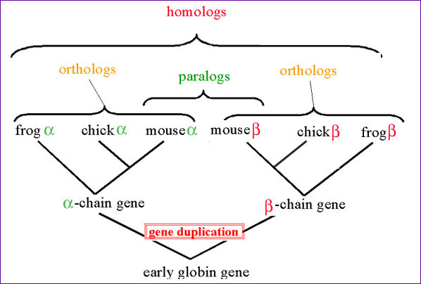
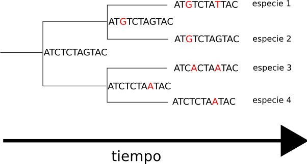
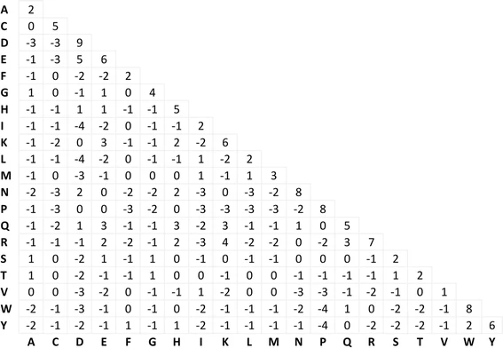
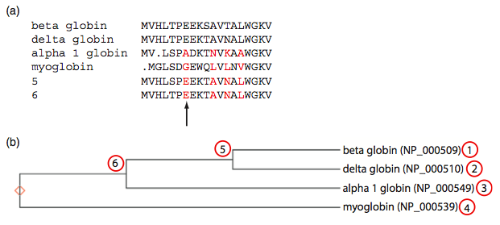
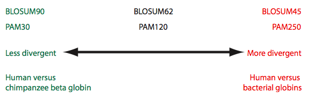

# Sequence Alignment


## Evolutionary concepts


Darwin’s finches

Evolution by natural selection.

Common ancestry.

Evolution will occur whenever two conditions are satisfied:

* Heritable variation

* Selective pressure


\cite{CanizaresSales}


More similarity, more recent common ancestor

## Homology

Homology: Descent from a common ancestor.

* Orthologs: Homologous sequences in ≠ species from a common ancestral gene during speciation (similar function).

* Paralogs: Homologous sequences within a single species by gene duplication.


## Gene duplication and divergence

During evolution, a gene can suffer a duplication: due to errors in the copy of DNA, a copy and the original gene will coexist.

This situation frees up the two resulting genes for evolution, since they will be somewhat freed from functional constraints. 

The resulting genes will evolve independently: they are paralogs.



\cite{Discoveryandinnovation.com}

Many proteins have a globin domain: a part of their sequence forms the globin fold: a series of eight α-helices.
All genes that contain a globin domain form part of the globin superfamily.

How does this look in terms of sequence?



\cite{CanizaresSales}

## Important definitions

* % identity: The extent to which 2 (nucleotide or aa) sequences
are invariant.

    Sequence 1: `AACGTTCCCGTA`
    
    Sequence 2: `AACGTACCCCTA`

* % similarity:The extent to which 2 protein sequences share identical or similar aa residues.

    Sequence 1: `TESKYLAMGMNW`
    
    Sequence 2: `TEWKYLVMGKNW`
    
* Conservative change: change at a specific position of a protein or a DNA sequence that preserve the physico-chemical properties of the original residue.

## Alignment

The task of placing and recognizing equivalent regions of 2 or more sequences to maximize their similarity.

Types of alignment:

* Global: to compare and find closely related sequences that are similar over their whole length.

* Local: Only parts of sequences are related.

Why is aligning important? How similar are these sequences?

```
CGATGCTAGCGTATCGTAGTCTATCGTAC
             |     ||
ACGATGCTAGCGTTTCGTATCATCGTA
```

And now?

```
-CGATGCTAGCGTATCGTAGTCTATCGTAC
 |||||||||||| |||||||||||||||
ACGATGCTAGCGTTTCGTA-TC-ATCGTA-
```

## Principles of alignment

* There is never just one possible alignment

* Alignment can reveal homology between sequences

* Protein sequences can be more informative than DNA:

    * 20 vs 4 characters.
  
    * Changes in the 3rd position of the codon often don’t alter the aa.

    * The 3D structure of a protein is determined by the aa sequence
  
* DNA alignments are appropriate:

    * To study noncoding regions of DNA (introns).

    * To study DNA polymorphisms.

    * Genome sequencing relies on DNA alignments.


## Pairwise sequence alignment

Pairwise sequence alignment: Process of lining up two sequences to achieve maximal levels of identity (and similarity, in the case of aa sequences) for the purpose of assessing the degree of similarity and the possibility of homology.

* It is used to decide if two proteins (or genes) are related structurally or functionally.

* It is used to identify domains or motifs that are shared between proteins.

* It is used in the analysis of genomes.

General approach:

1. Choose 2 sequences

2. Select an algorithm that generates a score

3. Allow gaps (insertions, deletions)

4. Score reflects degree of similarity

5. Alignments can be global or local

6. Estimate probability that the alignment occurred by chance


## Scoring Alignments

Score of an alignment

The quality of an alignment is measured by giving it a quantitative score.
The best-scoring will not necessarily be the correct one and conversely.
The score will be produced by applying a scoring system. It’s critical when choosing the best possible alignment.

### First approximation: identity %

Perfect alignment:

```
ATGCGGCAAA
||||||||||
ATGCGGCAAA
```

One substitution:

```
ATGCGGCAAA
|||| |||||
ATGCCGCAAA
```

What about this situation?
```
ATGCGGCAAA
|||||  ||
ATGCGCAAAT
```

Introduce a gap:

```
ATGCGGCAAA
||||| ||||
ATGCG CAAA
```

A gap increases the alignment. Which is best of the last two?

###  Gaps

An important part of building a scoring system is how you score gaps (positions at which a letter is paired with a null) in the alignment.

* Gap penalty: each time a gap is introduced, the penalty is subtracted from the score.

    * Gap creation: a gap is introduced in the sequence.

    * Gap extension: extending a gap by one residue (smaller penalty).


#### Exercise

Calculate the % identity (PDI) of these sequences:
```
thisisasequence
thissequence
```

```
THISISASEQUENCE 
THIS   SEQUENCE
```


### Dot-plot (Dot matrix)


\cite{Discoveryandinnovation.com}

Provides a visual assessment of similarity based on identity.

There will be some random matches.

Let’s consider these sequences as aminoacid sequences


### Exercise

Calculate the % identity (PDI) of these sequences:

```
thatsequence
thisisasequence
```

```
TH    ATSEQUENCE 
THISISA SEQUENCE
```

An alternative alignment:
```
THAT   SEQUENCE 
||||   ||||||||
THISISASEQUENCE
```

Is this better or worse?

* I ~ A : hydrophobic

* S ~ T : -OH & polar


\cite{Microbenotes.com}

Pairs of:

* identical aa: highest score

* aa ~ properties: higher than ≠ properties

## Interpreting alignment scores

Overall alignment score: sum of the values at all positions.

Minimum percentage identity accepted as significant (Burkhard Rost):

* > 30% threshold sequence identity: Homology

* 30% > threshold sequence identity > 20%: Twilight zone → Homology may exist but cannot be reliably assumed in absence of other evidence.

* < 20% threshold sequence identity: Midnight zone

## Substitution matrices

Necessary to score alignments in which we allow mismatches.

Define values for all possible pairs of residues

Contain values proportional to the probability that $aa_i$ mutates into $aa_j$ for all pairs of aa.



\cite{Rios2015}

### Building substitution matrices

Constructed by assembling a large and diverse sample of verified pairwise alignments (or MSA) of aa.

Reflect the true probabilities of mutations occurring through a period of evolution.

Two types: PAM and  BLOSUM

Building a PAM matrix: 1960s – 1970s: Margaret Dayhoff and colleagues developed scoring matrices.

Some protein families evolve slowly, others change rapidly.

They are based on global alignments of closely related proteins.

PAM1 used for sequences with < 1% divergence.

Evolutionary interval: 1 change over a length of 100 aa.

Other PAM matrices are extrapolated from PAM1:

* PAM250: 250 changes over a length of 100 aa: corresponds to about 20% identity.

All the PAM data come from closely related proteins: >85% aa identity.

### Dayhoff model

#### Step 1: identify accepted point mutations (PAMs)

Evolution accepts some point mutations and rejects others (eg conservative changes).

We can align highly conserved sequences and then examine them for an empirical measure of the frequency of each change.



\cite{Pevsner2015}
\cite{Dayhoff1978}

Phylogenetic: compares to the inferred ancestor.

Amino acid substitutions:

* Green-shaded boxes: substitutions very commonly accepted.

* Orange-shaded boxes: rarely substituted by any other residue.

Original (columns); Changes (rows)

1571 mutations

#### Step 2

Relative frequency of aminoacids. Not every aa is equally frequent in nature.


TODO: table

@Pevsner2015


#### Step 3

Relative mutability of aminoacids. Not all aminoacids are equally evolutionarily stable.
Criticality of structural / functional role.
Existence of similar aminoacids
Number of mutations required in DNA (genetic code).

TODO: table

@Pevsner2015

Freq of PAM / freq of aminoacid


Dayhoff model

#### Step 4

Mutation probability matrix for the evolutionary distance of 1 PAM (The PAM1 mutation probability matrix).

1 PAM is defined as the evolutionary divergence in which 1% of aa have been changed between two proteins. Not directly translatable into years. Original in columns.Replacement in rows.

TODO: table


@Pevsner2015


#### Step 5

PAM250 and other PAM matrices: PAM250 can be generated by multiplying the PAM1 matrix by itself 250 times.

Very interesting for comparing distantly related proteins.

It corresponds to about 20% identity.

@Pevsner2015


PAM 250

TODO: table

#### Step 6: Relatedness odds matrix

It reports the probability that $aa_j$ aligns to $aa_i$ in a homologous sequence, compared to the probability in a non-related sequence: the odds ratio.

Numerator: models the observed change (mutation probability matrix)

Denominator: probability of aa residue i occurring in the second sequence by chance (aminoacid frequency).

$R_ij$ > 1: the replacement happens more often than expected by chance.

$R_ij$ < 1: the replacement is not favored.


$$R_{ij} = \frac{M_{ij}}{f_i}$$


#### Step 7: Log-odds scoring matrix.

@Pevsner2015

Why log odds?

We want a scoring matrix so that when we do a pairwise alignment (or a BLAST search) we know what score to assign to two aligned amino acid residues.

Logarithms are easier to use for a scoring system. They allow us to sum the scores of aligned residues (rather than having to multiply them).

Log-odds matrix for PAM250 

TODO: table

Here, a positive score means that the replacement occurs more frequently in related proteins than expected by chance.
That is, it is a lot more likely that a tryptophan stays a tryptophan than that it changes to anything else, even in fairly distantly related proteins.


@Pevsner2015


### BLOSUM matrices
An alternative to PAM matrices.
They are based on local multiple alignments.
They are based on observed alignments; they are not extrapolated from comparisons of closely related proteins.
Stands for blocks substitution matrix.

BLOSUM62: Calculated from comparisons of sequence blocks with up to 62% identity.

Performs better than most of BLOSUM and PAM matrices at detecting distant relationships between proteins.

TODO: table

@Pevsner2015

* Positive for chemically similar

* Common have low weights

* Rare have high weights

### Applications of different matrices



@Pevsner2015

## Alignment algorithms

### Global alignment algorithm of Needleman and Wunsch

2 sequences can be compared in a matrix along x- & y-axes.

If they are identical, what will the graph look like?

Mini exercise: Use this  to align any sequence of aminoacids to itself.


Objective: find the optimal subpaths, and add them up to achieve the best score. This involves:

* adding gaps when needed

* allowing for conservative substitutions

* choosing a scoring system (simple or complicated)
Needleman-Wunsch is guaranteed to find optimal alignment(s), but it scales poorly with the length of sequences.

Steps:

* Set up a matrix

* Score the matrix

* Identify the optimal alignment(s)

Example alignments

TODO: figure

#### Procedure:

Sequences of length m and n: Matrix: m+1 by n+1.

Addition of gap penalties in first row and column.

Each gap position gives a score of -2.

Grey-shaded boxes: identity.

1. Set up matrix

2. Score matrix

3. Trace optimal path

TODO: images

Step 2: Score matrix

We use a very simple scoring scheme for simplicity, but it would be more appropriate to use a PAM or BLOSUM scoring matrix.

Each cell gets the best score from three possibilities: top, left (both of which represent gaps) or top-left (match or mismatch). We note the cell from which we got the best score for later use.
49

Step 3: trace optimal path

TODO: image

Highlighted cells: optimal path (best scores) → resulting alignment.
Begin at the lower right cell and proceed back to the start following the red arrows in the previous figure.

#### Exercises

* Align these two sequences by hand using the Needleman-Wunsch algorithm with the scoring scheme we used earlier:
```
THURSDAY
```
```
TUESDAY
```

* Align the human and mouse myoglobin protein sequences using an online tool from [NCBI](https://blast.ncbi.nlm.nih.gov/Blast.cgi?PAGE_TYPE=BlastSearch&PROG_DEF=blastn&BLAST_PROG_DEF=blastn&BLAST_SPEC=GlobalAln&LINK_LOC=BlastHomeLink) or [EBI](https://www.ebi.ac.uk/Tools/psa/emboss_needle/). Discuss the results.  Where is similarity concentrated? Are these sequences homologous?

* Install the emboss software suite, which contains “needle” , a program to perform global alignments with Needleman-Wunsch.
```
conda install emboss -c bioconda
```
	Use it to align the earlier sequences. What’s their percentage similarity? And their percentage identity?
	
	
## BLAST

You should know… 

* How blast speeds up pair alignments. 

* A blast alignment is essentially the same as a local DP alignment. 

* What an E-value tells you

### Global versus local alignments

Global alignment (Needleman-Wunsch) extends from one end of each sequence to the other.

Local alignment finds optimally matching  regions within two sequences (“subsequences”).

Local alignment is almost always used for database searches such as BLAST. It is useful to find domains (or limited regions of homology) within sequences.

Smith and Waterman (1981) solved the problem of  performing optimal local sequence alignment. Other methods (BLAST, FASTA) are faster but less thorough.

TODO: image? text?

@Pevsner2015

Global alignment (top) includes matches ignored by local alignment (bottom)

### BLAST & FASTA

Smith-Waterman is very rigorous and it is guaranteed to find an optimal alignment. 

But Smith-Waterman is slow. It requires computer space and time proportional to the product of the two sequences being aligned (or the product of a query against an entire database). 

For that, we use heuristic local alignment tools.


### The FASTA format

A sequence in FASTA format begins with a single-line description, followed by lines of sequence data.
Description line (defline) is distinguished from the sequence data by a greater-than (">") symbol at the beginning.
It is recommended that all lines of text be shorter than 80 characters in length.
```
>P01013 GENE X PROTEIN (OVALBUMIN-RELATED)
QIKDLLVSSSTDLDTTLVLVNAIYFKGMWKTAFNAEDTREMPFHVTKQESKPVQMMCMNNSFNVATLPAE
KMKILELPFASGDLSMLVLLPDEVSDLERIEKTINFEKLTEWTNPNTMEKRRVKVYLPQMKIEEKYNLTS
VLMALGMTDLFIPSANLTGISSAESLKISQAVHGAFMELSEDGIEMAGSTGVIEDIKHSPESEQFRADHP
FLFLIKHNPTNTIVYFGRYWSP
```

### The BLAST Algorithm

BLAST (Basic Local Alignment Search Tool) allows rapid sequence comparison of a query sequence against a database.

The BLAST algorithm is fast, accurate, and accessible both via the web and the command line.

BLAST searching is fundamental to understanding the relatedness of any favorite query sequence to other known proteins or DNA sequences.

How BLAST works:

1. Query sequence is broken into small words, typically 3 aminoacids long for proteins.

2. These are used to search against a database that is pre-indexed for each word above a score threshold.

3. Matches are extended and scored.

The keys to its speed are the pre-indexing and the limiting to small words. How big is the vocabulary with 3 aa?

### Applications of BLAST

* Identifying orthologs and paralogs

* Discovering new genes or proteins

* Discovering variants of genes or proteins

* Investigating expressed sequence tags (ESTs)

* Exploring protein structure and function

### BLAST search steps

1. Specifying sequence of interest
2. Selecting BLAST program
3. Selecting a database
4. Selecting search parameters and formatting parameters


### BLASTP search at NCBI

https://blast.ncbi.nlm.nih.gov/Blast.cgi?PAGE=Proteins

Let’s try it with one of my favorite proteins: human SHH (NP_000184). We’ll search mouse refseq proteins.

* What do you expect we will find? 

* How many results? 

* How similar?

Look at the “graphic summary” tab.

#### Exercise

Use the human myoglobin protein as a query to search for paralogous protein sequences. 

* In which database would you search?

* Would you limit the search in any way?

* What do you expect to find, and what do you actually find?

Find cytoglobins, where are hemoglobins? Tweak algorithm parameters -> scoring matrix.

### BLAST variants: Choosing a BLAST program
We will choose depending on our biological question.

TODO: blast variants image

Choosing a database: proteins

TODO: table

Choosing a database: nucleotides

TODO: table

* Numbers from 2015

### Optional parameters

* Choose the organism to search

* Turn filtering on/off

* Change the substitution matrix

* Change the expect (e) value

* Change the word size 

* Change the output format


TODO: blast variants image


## Multiple sequence alignment

Definition: Collection of 3 or more protein (or nucleic acid) sequences that are partially or completely aligned.

Homologous residues are aligned in columns across the length of the sequences.

Aligned residues are presumed to be homologous:

* Evolutionary sense (derived from a common ancestor)

* Structural sense (aligned residues tend to occupy corresponding positions in 3D structure)

### Procedure

Easy to generate for a group of closely related proteins.

Steps:

1. Choose homologous sequences to align.

2. Choose software that implements an appropriate objective scoring function.

3. Choose appropriate parameters (gap opening, gap extension penalties)

4. Interpret the output and re-run the analyses as needed. 

### Properties

Not necessarily one “correct” alignment of a protein family.

Protein sequences and its 3D structures evolve.

It may be impossible to identify aa residues that should be aligned with each other as defined by the 3D structures of the proteins throughout a MSA

### Features

Some aligned residues may be highly conserved (e.g. cysteines).

There may be conserved motifs (transmembrane domain).

There may be conserved secondary structure features.

There may be regions with consistent patterns of indels.

### Uses of MSA

It is more sensitive than pairwise alignment to detect homologs.

Any database (BLAST) output can take the form of a MSA, revealing conserved residues or motifs.

A single query can be searched against a DB of MSAs (e.g. PFAM).

Regulatory regions of genes may have consensus sequences identifiable by MSA.

### MSA methods

Five different kinds of MSA methods:

* Exact methods

* Progressive methods

* Iterative methods

* Consistency-based algorithms

* Structure-based methods

#### Exact methods

They use dynamic programming with a multidimensional matrix.

Guaranteed to find optimal solutions.

Not feasible for more than a few sequences: computationally unaffordable.

#### Progressive methods

Combine pairwise alignments one by one to create a MSA:

1. Calculate the pairwise sequence alignment scores between all the proteins being aligned.

2. Begin the alignment with the two closest sequences.

3. Add more sequences to the alignment.

The final alignment depends on the order in which sequences are joined → not guaranteed to provide the most accurate alignment.

Using a guide tree:

TODO: guide tree

Examples: CLUSTAL OMEGA, MUSCLE.


#### Iterative methods

Compute a suboptimal solution using a progressive alignment strategy.

Modify the alignment using dynamic programming or other methods until the solution converges.

Examples: MUSCLE, MAFFT

TODO: 6.6 Pevsner

@Pevsner2015


#### Consistency-based algorithms

Generally use a DB of both local high-scoring alignments and long-range global alignments to create a final alignment.

These are very powerful, fast, and accurate methods.

Sequence x	Residue xi

Sequence y	Residue yj

Sequence z	Residue zk

If xi aligns with zk and zk aligns with yj → xi should align with yj

Examples: T-COFFEE
81

#### Structure-based methods

Since tertiary structure is more constrained than sequence, these methods incorporate structural information to facilitate alignment near the “twilight zone”.

### Benchmarking

Datasets for benchmarking multiple alignment algorithms are precomputed by hand by structural similarity.

The method used to construct the database must be independent of the method tested against the database.

## MSA of genomic DNA

There are typically few sequences (up to several dozen), each having up to millions of base pairs. Adding more species improves accuracy.

Alignment of divergent sequences often reveals islands of conservation (providing “anchors” for alignment).

Chromosomes are subject to inversions, duplications, deletions, and translocations (often involving millions of base pairs). E.g. human chromosome 2 is derived from the fusion of two acrocentric chromosomes.

There are no benchmark datasets available.

TODO: include large scale graph so they understand how it looks.

## MSA tools and Databases

### EMBL-EBI tools

https://www.ebi.ac.uk/Tools/msa/

Exercise: Align the kinases from 10 organisms that you can find [here](http://people.virginia.edu/~wrp/cshl05/mcclure-seqs/kinases/kin10.fasta).

### NCBI tools

https://blast.ncbi.nlm.nih.gov/Blast.cgi?PAGE=Proteins

Exercise: Align the same set of sequences.

#### Exercise
Align the sequences of the following proteins with one of the online tools:

* How similar are they?

* From the results of the alignment, can you hypothesize what parts of the sequence are critical for the structure?

AAA16334.1
AAA49734.1
NP_988859.1
AAB59638.1
AAB59723.1
ABD95911.1
CAA32473.1
CAA23701.1
NP_976312.1
NP_001161224.1


### MSA in the command line

Getting sequences

```
conda install entrez-direct -c bioconda
```
Installing MUSCLE
```
conda install muscle -c bioconda
```

## Edirect

Edirect is a suite of command line utilities for searching NCBI databases and fetching records.

Searching:
```
esearch -db [database] -query [query]
```
Fetching directly
```
efetch -db [database] -id [id or comma-separated list of ids]
```
Chaining
```
esearch -db pubmed -query “Mateos San Martin” | efetch -format abstract
```
Many more examples in one of the "Further reading links"

#### Exercise

Fetch, using the command line, the sequences for the same proteins as before. 

Save them in a file called globins.fasta

Solution:

```
efetch -db protein -id AAA16334.1,AAA49734.1,NP_988859.1,AAB59638.1,AAB59723.1,ABD95911.1,CAA32473.1,CAA23701.1,NP_976312.1,NP_001161224.1 -format fasta > globins.fasta
```


### MUSCLE

Aligning multiple sequences locally is easy with muscle:
```
muscle -in globins.fasta -out globins.afa
```
The default output format is not very readable, so you might want to use the CLUSTALW format or html. 

Plain text formats are always better to feed later algorithms in a pipeline, while html can be more readable (although this particular one is pretty ugly). 

\cite{Edgar2004}

### Pfam

Pfam is a protein family database of profile HMMs. It collects the information from related proteins organized in families.

Families of proteins share domains, functionally independent sections of their sequence that often have a semiglobular 3D shape and are stable independently.

The different domains in a protein may have evolved independently.

These are identified by aligning thousands of protein sequences.

https://pfam.xfam.org/

### SMART

SMART is another protein family database.

http://smart.embl-heidelberg.de/

It has extensive links to other databases with evolutionary, functional, or literature information regarding each family.


## Further Reading

@Pevsner2015

https://www.ncbi.nlm.nih.gov/books/NBK153387/

ftp://ftp.ncbi.nlm.nih.gov/pub/factsheets/HowTo_BLASTGuide.pdf

http://nebc.nerc.ac.uk/bioinformatics/documentation/muscle/muscle.html

http://bioinformatics.cvr.ac.uk/blog/ncbi-entrez-direct-unix-e-utilities/

https://github.com/NCBI-Hackathons/EDirectCookbook

http://www.ibi.vu.nl/teaching/mnw_2year/2007/mnw2yr_lec8_2007.pdf

http://www.pdg.cnb.uam.es/cursos/MSA2013.pdf
