# Molecular Phylogeny

## Foundations of Evolutionary Biology and Molecular phylogeny

Evolution: 2 core phenomena drive evolution:

* Copy with variation: at a molecular level, mutation

* Selection

At the molecular level, evolution is a process of mutation with selection. 

Molecular Phylogeny is the study of the evolutionary relationship among organisms or among molecules using the techniques of molecular biology.

Objectives:

* Deduce the correct trees for all species of life.

* Infer or estimate the time of divergence between organisms since the time they last shared a common ancestor.

## Phylogenetic Tree

Graphical representation of the relationships between homologous proteins (or nucleic acid sequences), or organisms.
Essentially a graphical representation of a MSA.

Any group of homologous proteins (or N.A.) can be depicted in a PT.

- True tree: depicts the actual, historical events that occurred in evolution.

- Inferred tree: hypothesized version of the historical events.

## First molecular phylogeny

1960s, Margaret Dayhoff et al.

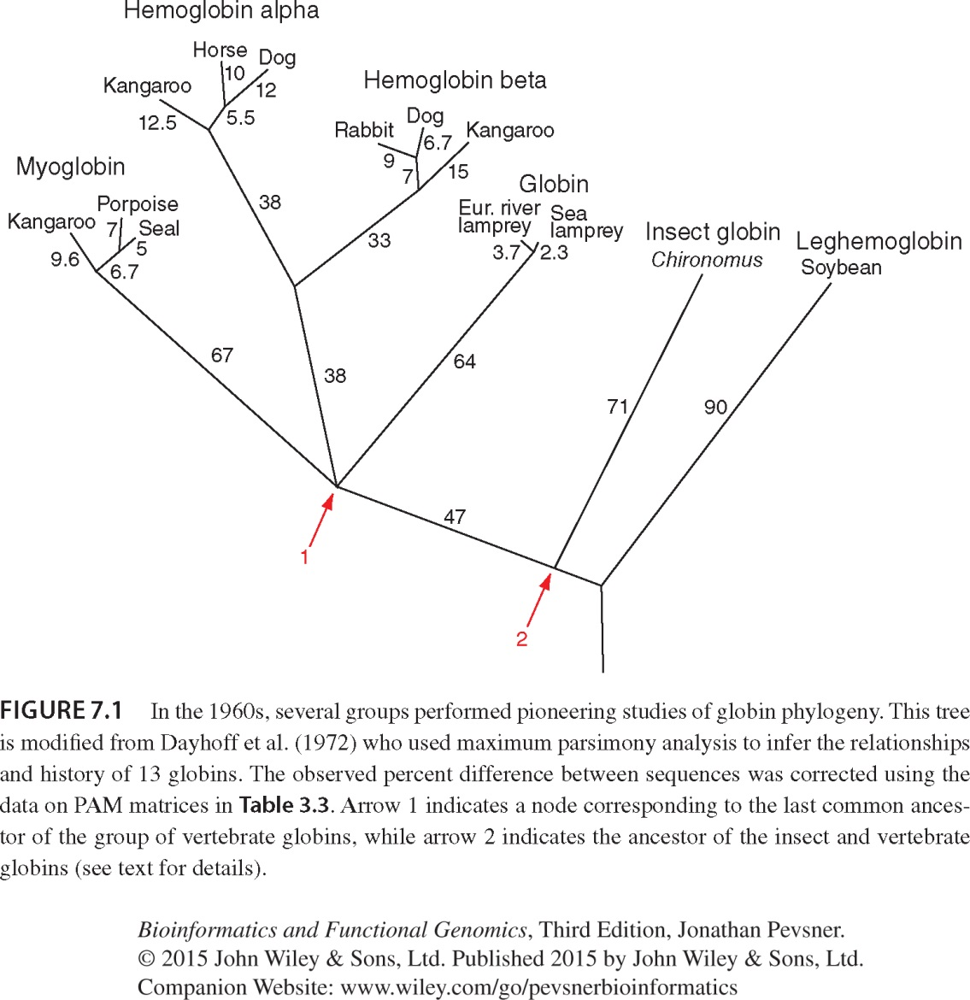

@Pevsner2015

* Arrow 1: node corresponding to last common ancestor of a group of vertebrate globins.

* Arrow 2:  ancestor of insect and vertebrate globins

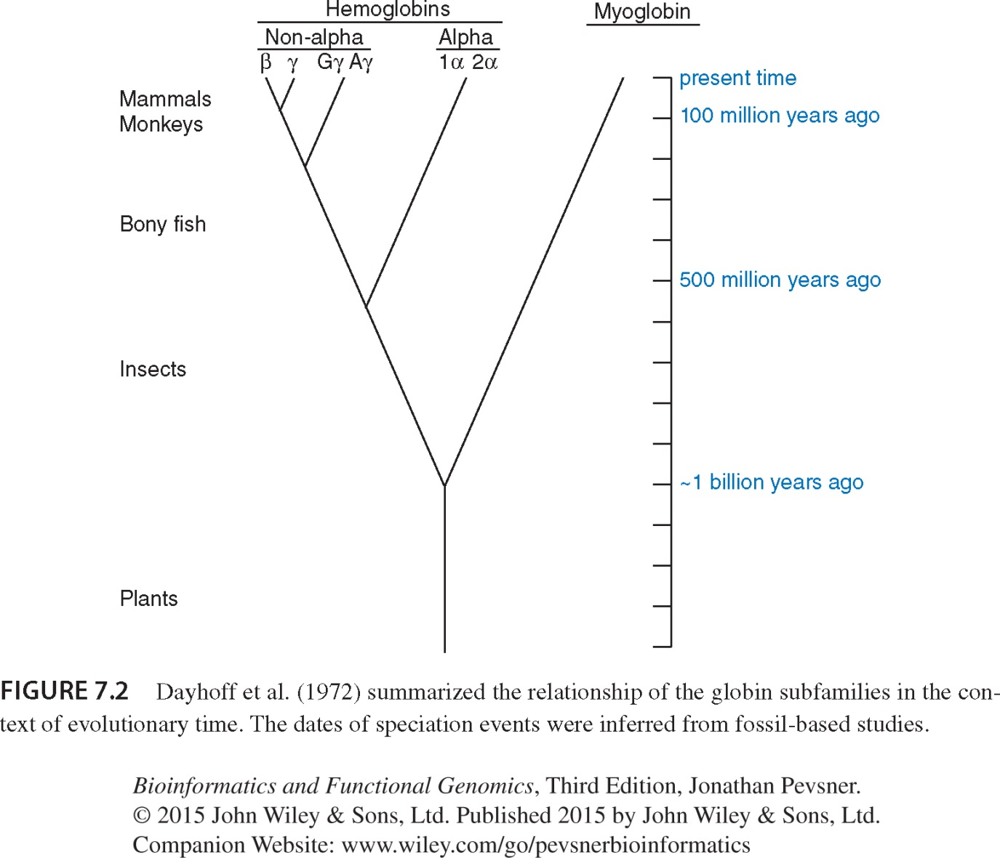

Link to evolutionary time: The more differences we observe between two protein or nucleotide sequences, the longer ago we can infer they diverged, but we can't tell the time since divergence directly.

## Molecular clock hypothesis

In the 1960s, sequence data were accumulated for small, abundant proteins such as globins, cytochromes c, and fibrinopeptides. Some proteins appeared to evolve slowly, while others evolved rapidly.

Linus Pauling, Emanuel Margoliash and others  proposed the hypothesis of a molecular clock: 

For every given protein, the rate of molecular evolution is approximately constant in all evolutionary lineages

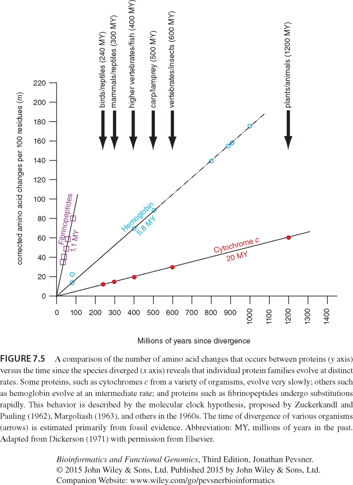

Turns out, this holds up pretty well.

If protein sequences evolve at constant rates, they can be used to estimate the times that  sequences diverged. This is analogous to dating geological specimens by radioactive decay.

## Types of mutations in molecular phylogeny

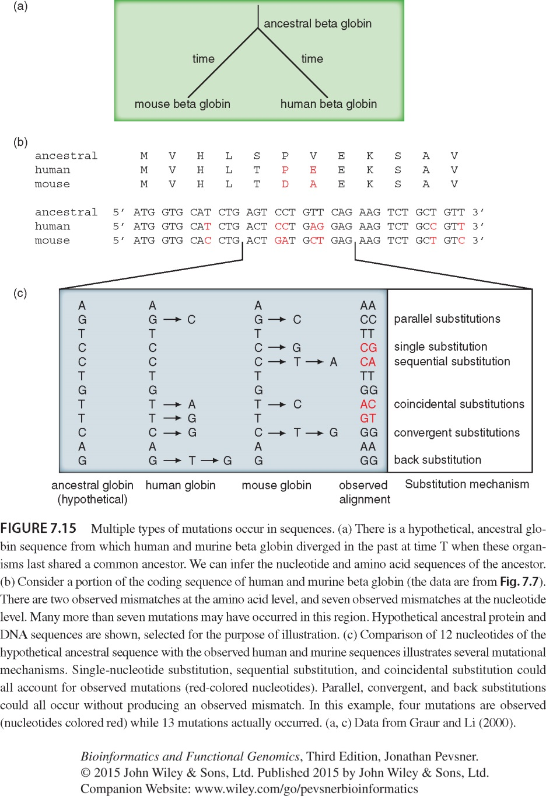

## The Neutral Theory of Molecular Evolution

Motoo Kimura (1968) estimated the rate of nucleotide substitution at population level.

It is too high to be explained by selection, so he proposed that most substitutions are neutral, so the main origin of variability is random drift of mutant alleles.

@Kimura1968

## Positive and negative selection

Darwin’s theory of evolution suggests that, at the phenotypic level, traits in a population that enhance survival are selected for, while traits that reduce fitness are selected against. 
We can deduce whether two nucleotide sequences have been under positive, negative, or neutral selection by looking at synonymous versus nonsynonymous substitutions.

* dN > dS: positive selection

* dN < dS: negative (“purifying”) selection

* dN ≈ dS: no selection.

## Reading a tree

There are two main kinds of information inherent to any tree: topology and branch lengths.

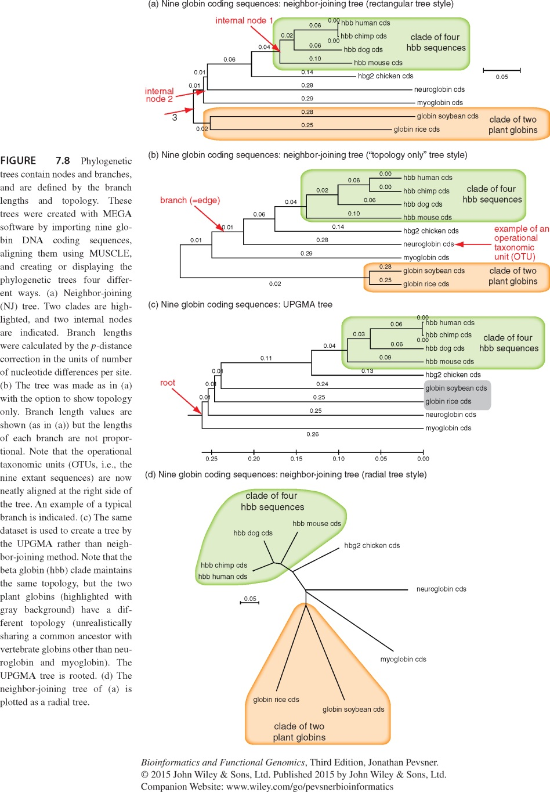

### Rooted and unrooted trees

An unrooted tree just represents the distance between the sequences, while a rooted tree includes a root that represents their most recent common ancestor.
This is done by including an outgroup, some sequence that is dissimilar to all the others. This allows us to select a branch as the root.

TODO: image

### Species trees versus gene/protein trees

Molecular evolutionary studies can be complicated by the fact that both species and genes evolve.

Speciation usually occurs when a species becomes reproductively isolated. In a species tree, each internal node represents a speciation event.

Genes (and proteins) may duplicate or otherwise evolve before or after any given speciation event. The topology of a 
gene (or protein) based tree may differ from the topology of a species tree.

A gene (e.g. a globin) may duplicate before or after two species diverge!

TODO: better diagram. I dont like what happens with 1 and 4/5 in this one.

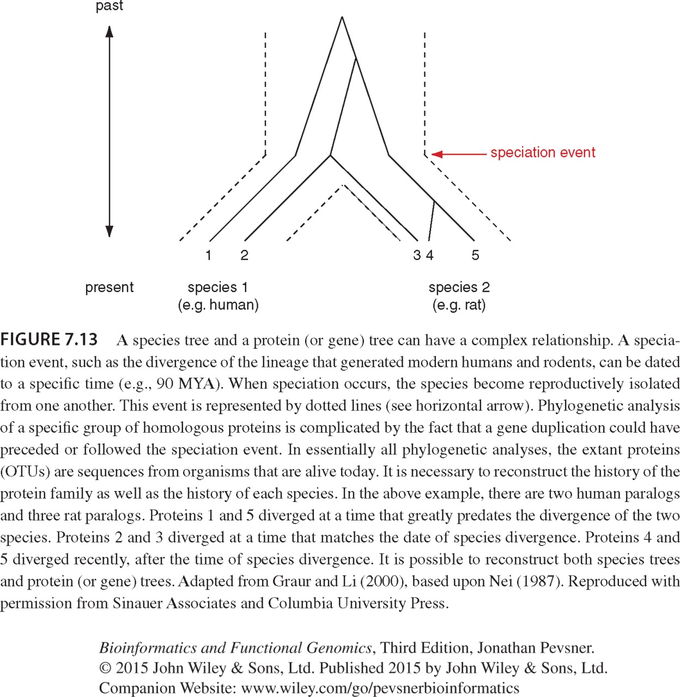

@Pevsner2015

Where are the gene duplication events??

## Phylogenetic analysis

Five stages of phylogenetic analysis:

1. Sequence acquisition

2. Multiple sequence alignment

3. Models of DNA and amino acid substitution

4. Tree-building. Methods: 

    * Distance-based

    * Character-based

5. Evaluating trees 

### Multiple sequence alignment

The fundamental basis of a phylogenetic tree is a multiple sequence alignment. 

If there is a misalignment, or if a nonhomologous sequence is included in the alignment, it will still be possible to generate a tree but it might not have any biological relevance.

### Models of substitution

The simplest approach to  measuring distances between sequences is to align pairs of sequences, and then to count the number of differences. The degree of divergence is called the Hamming distance. For an alignment of length N with n sites at which there are differences, the degree of divergence D is:

$$D = n / N $$

Observed differences do not equal genetic distance! Genetic distance involves mutations that are not observed directly

Also, not all substitutions are equally likely; transitions are more probable than transversions, for example.

## Tree-building methods

* Distance-based methods: Involve a distance metric, such as the number of amino acid changes between the sequences, or a distance score.

    * UPGMA (unweighted pair group method using arithmetic mean)

    * Neighbour-joining
    
* Character-based methods: Rather than pairwise distances between proteins, evaluate the aligned columns of amino acid residues (characters). 

    * Maximum parsimony
    * Maximum likelihood
    * Bayesian inference

### UPGMA

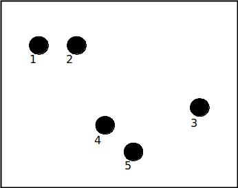

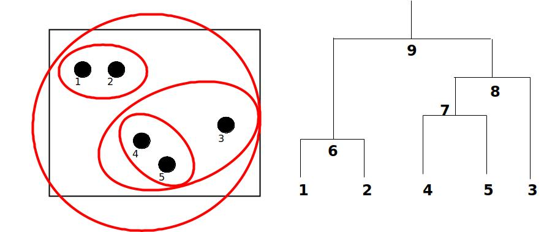

Compute the pairwise distances of all the proteins. Get ready to put the numbers 1-5 at the bottom of your new tree. 
Find the two proteins with the  smallest pairwise distance. 
Cluster them by calculating their average distance to the rest of the units in the table.
Do it again. Find the next two proteins with the smallest pairwise distance. Cluster them.
Keep going until you group all proteins together. That is your tree!

#### Exercise: build a tree by UPGMA

TODO: table of data

An UPGMA tree is always rooted.

An assumption of the algorithm is that the molecular clock is constant for sequences in the tree. If there  are unequal substitution rates, the tree may be wrong.

While UPGMA is simple, it is less accurate than the  neighbor-joining approach.

### Neighbor-joining

It is an alternative distance-based methods that is quite fast, especially for large numbers of sequences.

### Maximum parsimony

Involves the search for the tree with the fewest aa (or nucleotide) changes that account for the observed differences between taxa.

Identify informative sites. For example, constant  characters are not parsimony-informative.

Construct trees, counting the number of changes required to create each tree. For about 12 taxa or fewer, evaluate all possible trees exhaustively; for >12 taxa perform a heuristic search.

Select the shortest tree (or trees).

For example, how may have four sequences AAA, AAG, GGA, AGA evolved from an AAA ancestor?

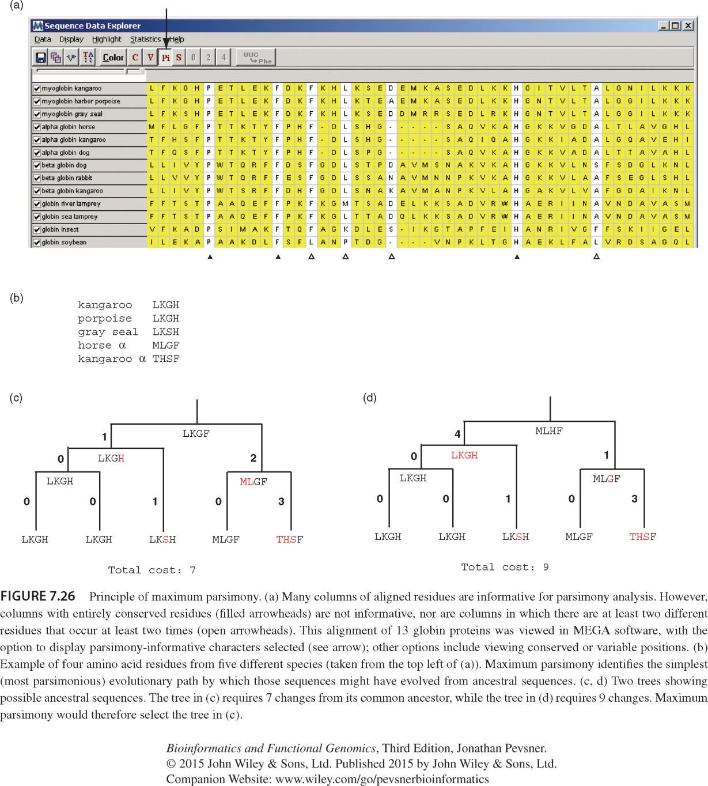

### Maximum likelihood

Maximum likelihood is an alternative to maximum parsimony. It is computationally intensive. A likelihood is calculated for the probability of each residue in an alignment, based upon some model of the substitution process.
What are the tree topology and branch lengths that have the greatest likelihood of producing the observed data set?

ML is implemented in the TREE-PUZZLE program, as well as MEGA, PAUP and PHYLIP.

### Bayesian inference

Bayesian inference is extremely popular for phylogenetic analyses (as is maximum likelihood). Both methods offer sophisticated statistical models. MrBayes is a very commonly used program.

Notably, Bayesian approaches require you to specify prior assumptions about the model of evolution.

$$P\left(Tree|Data\right) = \frac{P\left(Data|Tree\right) \times P\left(Tree\right) }{P\left(Data\right)}$$

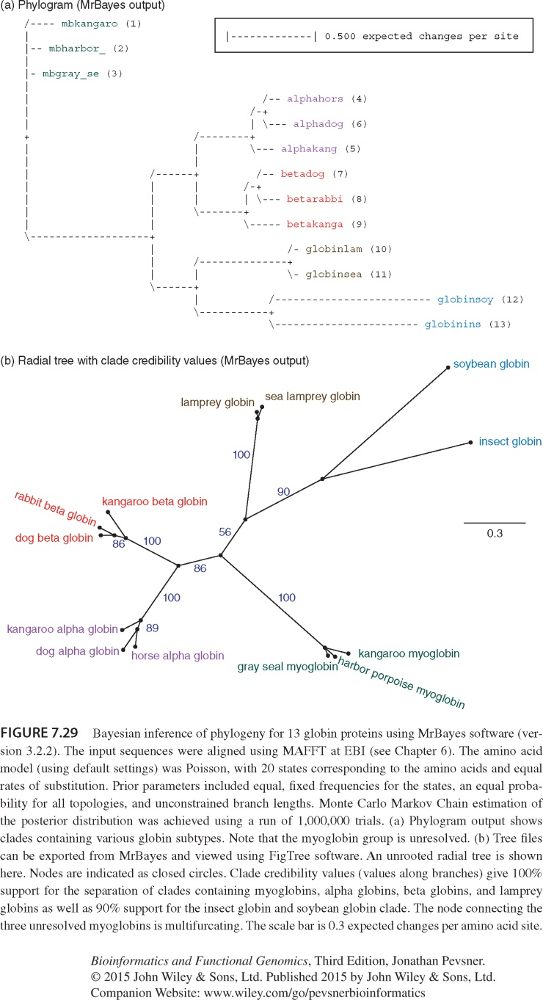

## Evaluating trees: bootstrapping

Bootstrapping is a commonly used approach to measuring the robustness of a tree topology.
Given a branching order, how consistently does an algorithm find that branching order in a  randomly permuted version of the original data set?

#### Exercise: the primate family tree

Here you can find a tree from “A Molecular Phylogeny of Living Primates” @Perelman2011. Answer the following questions based on it:

* What is closer to Gorilla, Homo or Pan (chimpanzees)?

* What is more diverse, the Cercopithecidae or the Hominidae/Hylobatidae group?

* In building it, have they used any outgroups? Which?

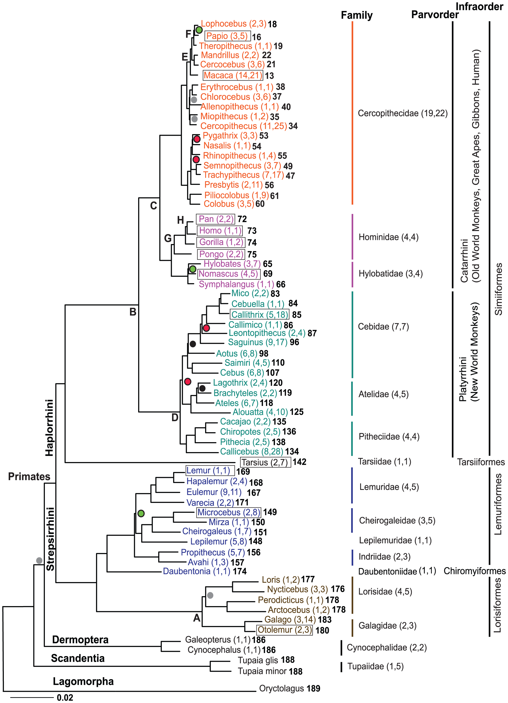

@Perelman2011

## Using MEGA for phylogenetic analysis

MEGA is a program that allows the researcher to perform multiple alignments and phylogenetic analyses.

You’ll need to install it from the [MEGA download page](https://www.megasoftware.net/download_form).

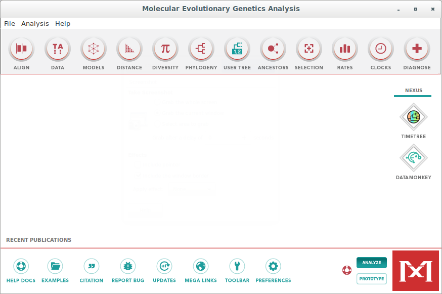

### Opening sequences

Open a fasta file, or an aligned fasta file.

If you use a regular sequence file, you’ll need to align the sequences using MEGA. MEGA implements both the CLUSTALW and MUSCLE algorithms.

You can actually BLAST directly from within MEGA to retrieve sequences.

Once the sequences are aligned, export as .meg

### Building a tree

Click on “phylogeny”

Select “build UPGMA tree” 

Once it’s done, you can inspect the tree, modify it, and export the image.

#### Exercise

The [small subunit ribosomal ribonucleic acid] is a gene that is present and highly conserved in all celled organisms. 
It is therefore often used for large scale phylogenetic analyses. In eukaryotes it’s the 18S RNA gene, in prokaryotes and archaea it’s the 16S, and in mitochondria it’s the 12S RNA. We are going to use it to build the tree of life!

Find a gene for the ssuRNA (there are often several copies per organism) for:

* Two mammals

* The mitochondria of those two mammals

* Two birds

* Two amphibians

* Two insects

* Two bacteria

* Two fungi

* Two plants

Then, align them and perform a phylogenetic analysis on them using MEGA.

Note: you can find taxon ids to use in entrez queries at the [NCBI taxonomy browser](https://www.ncbi.nlm.nih.gov/Taxonomy/Browser/wwwtax.cgi). 

You will then be able to use "txidXXXXXX[Organism]" as a search query. For example, for human (taxon id 9606):
txid9606[Organism]

## Further Reading

https://academic.oup.com/mbe/article/20/2/248/1003367

https://bioenv.gu.se/digitalAssets/1580/1580956_fyltreeeng.pdf

https://bmcbiol.biomedcentral.com/articles/10.1186/1741-7007-11-76

https://www.megasoftware.net/web_help_10/index.htm

https://evolution.berkeley.edu/evolibrary/misconceptions_faq.php

https://www.researchgate.net/profile/Sandip_Chakraborty7/post/Which_type_of_sequence_should_be_used_for_phylogenetic_tree_construction_conserved_or_non_conserved/attachment/59d61de479197b807797bed1/AS%3A273825759989760%401442296556699/download/rna_lecture.pdf

## References

[small subunit ribosomal ribonucleic acid]: https://en.wikipedia.org/wiki/SSU_rRNA