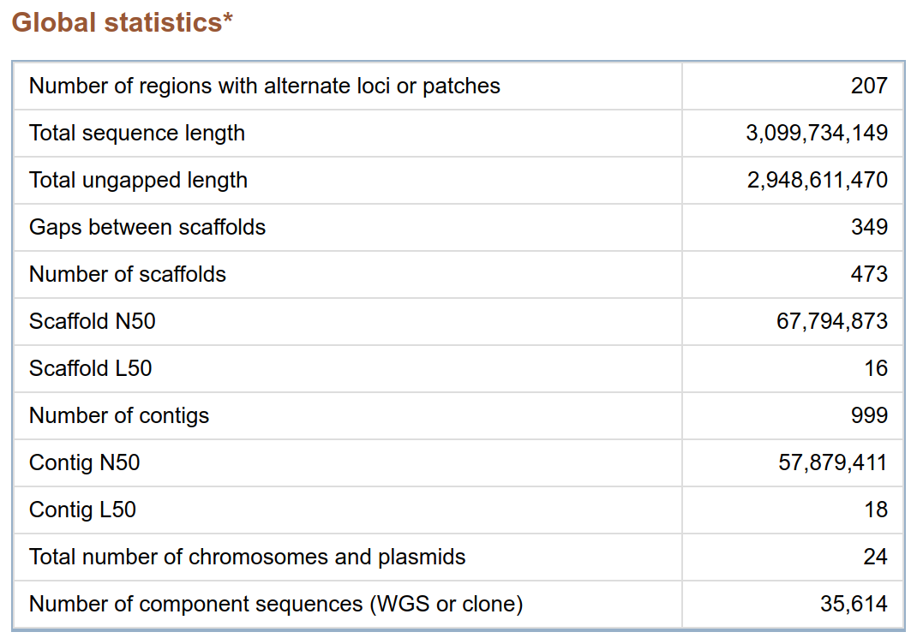
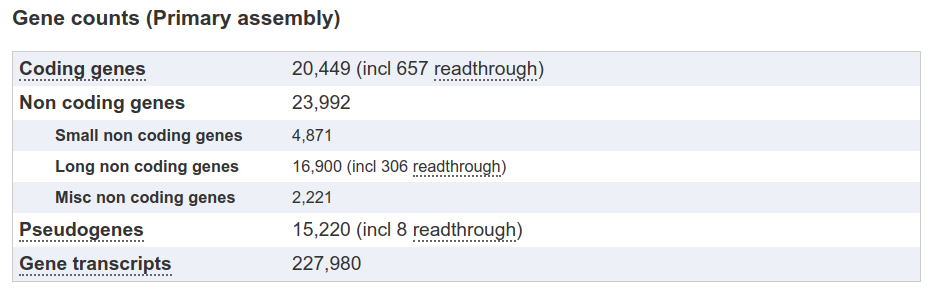
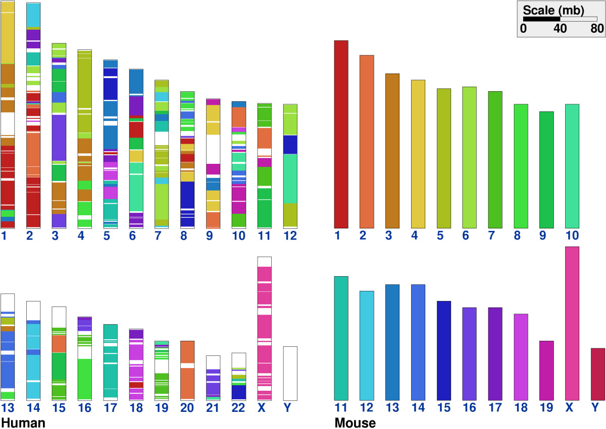
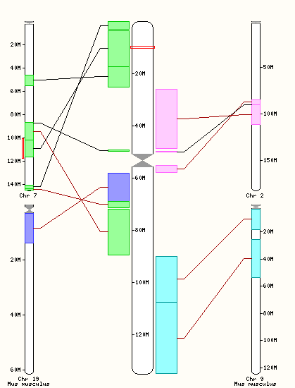
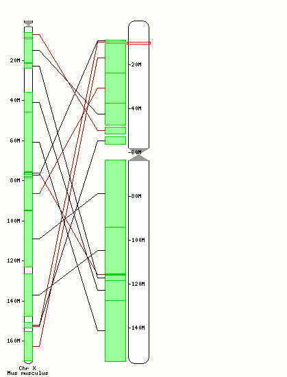
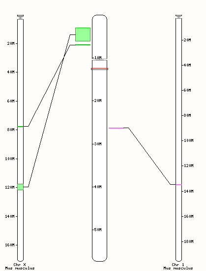
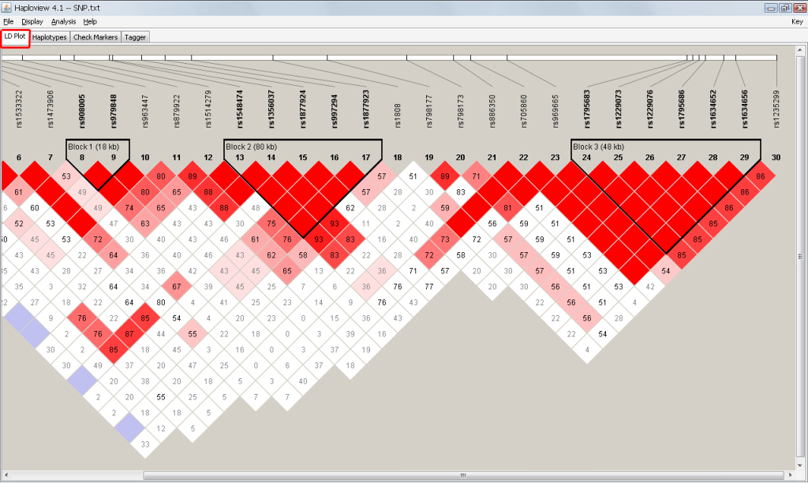

# Human genome

Dropped: Deeper looked at individual chromosomes.
Dropped: Exercise with synteny tool
Dropped: compare eukaryotes, talk about the c paradox, plants
Dropped: The Human Genome Project: the race, celera, Craig Venter, the cost of sequencing
Dropped: Garrod
TODO: Paleogenomics: Empezar con Jurassic Park, Svante Paabo y el neandertal, Church y el mamut.

## The Human Genome Project

The human genome is the complete set of DNA in Homo sapiens.

Having a reference human genome is important for research and medical applications.

In 2001 draft versions of the human genome were reported separately by the International Human Genome Sequencing Consortium (IHGSC) and by Celera Genomics.

### The public and private approaches

The human genome was sequenced in parallel by a public consortium (IHGSC) and by Celera Genomics. 
They used different sequencing strategies:

* Whole genome shotgun sequencing (Celera): This technique had the potential to be faster than that of the public consortium, but it was not clear that it would be succesful. They demonstrated it was feasible with large eukaryotic genomes by sequencing Drosophila.

* Hierarchical shotgun sequencing (public consortium): a more conscientious but slower approach. Each center was assigned a single chromosome. It handles better repetitive sequences, which comprise about 50% of the genome. It requires more human labor.

    * 29,000 BAC clones

    * 4.3 billion base pairs

TODO: rewrite and more narration

### Genome Reference Consortium (GRC)

The Genome Reference Consortium (GRC) coordinates new assemblies for human, mouse, and zebrafish genomes, looking after the reference genome for each species. 
The current human assembly is [Genome Reference Consortium Human Build 38] (abbreviated GRCh38).

Annotations are very important to using a reference sequence. Anything in a genome browser that is not the raw sequence of nucleotides is an annotation. The annotation of a new genome might take a long time and effort, so sometimes researchers prefer to use a build other than the last until the annotations they need are generated.

### Quality of the reference human genome

@NCBI

TODO: define finished, draft, and predraft.

N50 length: largest length L such that 50% of all nucleotides are contained in contigs or scaffolds of at least size L. 

The original genome sequence released  in 2001 included a mixture of finished, draft, and pre-draft data. It had an N50 of 8.4Mb.

@Pevsner2015

## Main conclusions of the Human Genome Project

### 1) There are about 20,310 human protein-coding genes. 

Initial estimates were a lot higher. In 2001 the public consortium estimated 31,000, while Celera estimated 38,500.

@Ensembl

There is not a clear correlation between complexity and number of genes. 

TODO: tableize, update

Fugu rubripes (pufferfish): 		31,000 to 38,000 
						18,500*
Arabidopsis thaliana (thale cress): 	27,600**
Caenorhabditis elegans (worm): 	20,300*
Drosophila melanogaster (fly): 		13,900*

* 2017 estimate from Ensembl
** 2017 estimate from TAIR

### 2) The human proteome is far more complex than the set of proteins encoded by invertebrate genomes. 

Although we don't have maby more genes than most invertebrates or plants, vertebrates have a very complex proteome thanks to mucho more extensive alternative splicing.

TODO: include the example of the crazy gene. Is it vertebrate specific?

### 3) 98% of the genome does not code for genes

This was a shock. Non-coding DNA even used to be called "Junk DNA".
Over 50% of the genome consists of repetitive DNA derived from transposable elements:

* LINEs (20%)

* SINEs (13%)

* LTR retrotransposons (8%)

* DNA transposons (3%) 

There has been a decline in activity of some of these elements in the human lineage.

TODO: add exercise: quantify the percent in a given region?
  Extract sequence
  Align -> generate BED?
  Coalesce, count

### 4) Segmental duplication is a frequent occurrence in the human genome.

* Tandem duplications (rare)
* Retrotransposition (intronless paralogs)
* Segmental duplications (common)

### 5) There are >1 million Alu repeats in the human genome.

These are about 300 base pairs and contain an AluI restriction enzyme site. About 10% of the genome is composed of Alu repeats
Their distribution is non-random: they are retained in GC-rich regions and may have some function.

### 6). The mutation rate is about twice as high in male meiosis than female meiosis. 

Most mutation probably occurs in males.

### 7) Human genetic variation

More than 1.4 million single nucleotide polymorphisms (SNPs) were identified. Celera initially identified 2.1 million SNPs.

Currently (2017), dbSNP at NCBI (build 151) has about 900 million SNPs. An individual genome has about 3-4 million SNPs. Fewer than 1% of SNPs alter protein sequence. 

NCBIa

TODO: algo que se haga con SNPs?

## Accessing and exploring the human genome

NCBI map viewer

https://www.ncbi.nlm.nih.gov/mapview/s

Ensembl Project (EBI/Sanger Institute)

www.ensembl.org

UCSC (Golden Path)

www.genome.ucsc.edu

TODO: Exercise: how to get the reference sequence for a particular section (chrosomomal coordinates)

### Ensembl conserved synteny display tool

Synteny: physical co-localization of genetic loci on the same chromosome within an individual or species

@Sinha2007

You can synteny display from the Ensembl genome browser. Click on the location tab, then on the left panel look for "comparative genomics".

https://www.ensembl.org/Homo_sapiens/Location/Synteny?r=11:10000000-20000000

#### TODO exercise: 

what is the origin of chromosome 2 in humans? Investigate with the synteny tool, by checking the synteny of chromosome 2 with chimpanzee, gorilla, and cow.

Also: TODO consider: Chromosomes 21 and 3 are derived from an ancient chromosome that split. Design an exercise to find this out.

Solution:

Human chromosome 2 shows synteny with two smaller chimpanzee chromosomes, which provides evidence that it originated by the fusion of two ancestral human acrocentric chromosomes. 

TODO: why fusion instead of breakage?

## The human genomic landscape

In this section we will explore the large-scale characteristics of the human genome.

These large scale characteristics fall in several categories:

* Long-range variation in GC content

* CpG islands

* Comparison of genetic and physical distance

* The repeat content of the human genome

* The protein-coding gene content of the human genome

* Non-coding genes

### GC content

The overall GC content of the human genome is 41%.

The distribution of GC content in the genome shows a broad profile with some skewness to the right.

### CpG islands

A cytosine followed by a guanine is called a CpG dinucleotide. These are heavily underrepresented in the human genome.

They are often methylated, especially in association with promoters of housekeeping genes.

They are important in gene silencing, genomic imprinting, and X-chromosome inactivation.

More details in @Deaton2011

TODO: Exercise?

### Genetic vs physical distance

Genetic maps (linkage maps) measure genetic distance based on meiotic recombination (DNA exchange).

The units are centimorgans (cM). One cM corresponds to 1% recombination.
Physical maps describe physical positions of DNA (genes)  in megabases (Mb).
A comparison of the two types of map reveals the rate of recombination per nucleotide.

@Pevsner2015

The recombination rate is lower near the centromere and higher near the telomeres, and is especially high in males

### The repeat content of the human genome

As mentioned earlier, the human genome has a high content of repetitive sequences. 
Some estimates indicate up to two thirds of the human genome may be repetitive (@Deaton2011).
These repetitive sequences fall into the following classes:

Interspersed repeats

* LINEs (21% of human genome)			

* SINEs (13%)					

* Long terminal repeat (LTR) transposons (8%)

* DNA transposons (3%)

Tandem repeats: 

* Microsatellites

* Minisatellites

TODO include visualizing repetitive elements, RepeatMasker 

Age of interspersed repeats: Human have a very low proportion of recent interspersed repeats compared to other lineages.

TODO: why? how does this mesh with high amount of repeats?

Simple sequence repeats (SSR) are almost perfect tandem repeats of k-mers. Microsatellites have k = 1 to 12, while minisatellites have k from ~12 to 500 base pairs. They are repeated 5-50 times.
Micro- and minisatellites comprise 3% of the genome. They are very useful for forensic analysis: identification by DNA, forensic analysis.

Segmental duplications: About 5% of the finished human genome sequence consists of segmental duplications, typically 10-50 kb.

### Human genes

According to @Ensembl, there are about 20,500 coding genes and around 24,000 non coding genes.

Human protein coding genes

The average coding sequence for human genes is 1340 bp, comparable to the size of an average coding sequence in C. elegans and Drosophila. Most internal exons are about 50–200 bp in length in all three species, although worm and fly have a greater proportion of longer exons.

However, the size of introns is much more variable in humans.

The human proteome: Humans have around 20,000 genes, but at least 70,000 different proteins (@Aebersold2018)

The number of protein-coding genes in humans is comparable to the number of genes in many other "simpler" organisms
However, humans might produce many more different proteins from a comparable number of protein-coding genes. 

@Pevsner2015

The human repertoire of protein domains shows a few domains used in many proteins.

## The 25 human chromosomes

* Autosomes: 1-22

* Chromosome X

* Chromosome Y

* Mitochondrial genome

## Human gene variation

SNPs represent a fundamental form of variation in the human population. We can document:

* The number of SNPs. Each person has 3-4 million single nucleotide variants (SNVs). 

* The sequence (major and minor allele)

* The copy number

* The allele frequencies (some SNPs occur more often in people from particular geographic backgrounds)

* The relationship to neighboring SNPs: Adjacent alleles are more likely to be coinherited thatn alleles located in different chromosomes, or far along the same chromosome. This is known as linkage disequilibrium and can be used to know the sequence of many SNPs by genotyping only a few representative SNPs.

### Haplotypes

A haplotype is a set of SNPs that tends to be coinherited.

Tag SNPs are useful because all the SNPs in the haplotype will be coinherited.
Genotyping just these three will allow us to uniquely identify all of them.

SNP data can be visualized with many tools, including:

* Browsers at UCSC, NCBI, and Ensembl

* HaploView

* Integrative Genomics Viewer (IGV) from the Broad Institute

* PLINK

HaploView is a tool for visualizing linkage disequilibrium and therefore haplotype blocks.

https://bioinfwit.wordpress.com/as-2/

### The HapMap project

The HapMap project (@Belmont2003, 2002-2009) aimed to develop a haplotype map of the human genome to describe common human variation.
This was to be useful to find associations to health and disease, and to understand genetic variation.
It represented a shortcut to a full picture of human genetic variation due to the high cost of sequencing.

The HapMap project contributed basic knowledge of human genetic variation. 

Important conclusions:

* Most variation occurs in African populations.

* Linkage disequilibrium displays a block-like structure 

* LD blocks may span multiple recombination hotspots.

* Some regions (e.g. centromeres) are characterized by lack of recombination across extended haplotype structures. 

* SNPs are useful for genome-wide association studies 

* Natural selection can remove deleterious mutations and preserve (fix) advantageous variants. 

* The prevalence of structural variation can be measured through SNP analysis. 

### The 1000 Genomes Project

The 1000 genomes project (@Altshuler2010, 2008-2015) is another project carried out by an international consortium that examined human genetic variation.
It consisted in NGS sequencing of many different individuals from 26 populations all over the world. its goal was to create a comprehensive resource on human genetic variation. It is significant as the first publicly available whole-genome sequence dataset on the population scale. 

@DeKoning2011

One specific aim was to identify most (>95%) of the genetic variants that have at least a 1% frequency in the populations being studied. Major conclusions:

* High rates of variation occur at the HLA and subtelomeric regions. Lowest rates occur in a 5 Mb, gene-dense region around 3p21. 

* A catalogue of SNPs was generated to facilitate later genome-wide association studies (GWAS).

* The number of variants has been described for different functional classes. 

TODO: rewrite

### Lessons on human genetic variation from sequencing individual genomes 

The cost of genome sequencing has declined steadily.
In 2007 the first two individual genomes were reported: J. Craig Venter and James Watson.
Individual genome sequencing has great potential for health applications but also great risk for personal privacy.

Recently, the UK government has announced plans to sequence the whole genome of every infant born in the country @Donnelly.

Trio sequencing, in which both parents and a child are sequenced, has shown that each individual harbors on the order of 100 _de novo_ variants.

## TODO include GWAS (or probably better in next chapter)

## Further reading

[The International HapMap Project](https://deepblue.lib.umich.edu/bitstream/handle/2027.42/62838/nature02168.pdf;jsessionid=9AB822AC62F01275B696CAE96ED3D6D1?sequence=1)

[The risk and promise of individual genome sequencing](https://www.economist.com/science-and-technology/2019/11/07/modern-genetics-will-improve-health-and-usher-in-designer-children)

[Genome Reference Consortium Human Build 38]: https://www.ncbi.nlm.nih.gov/assembly/GCF_000001405.26/